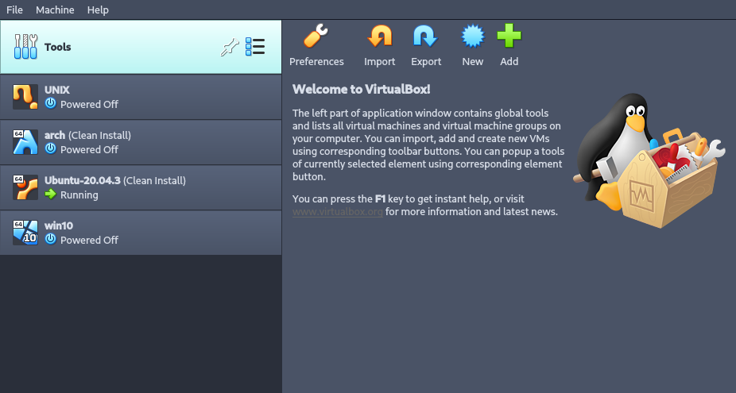

#! CS225 DZ01

## Instalacija virtuelne mašine



## Informacije o sistemu

```
#!/usr/bin/bash

set -v

uname -a

lscpu | head -n 16

free -h

lspci

lsusb
```

```
nik@ubuntu-test:~$ uname -a
Linux ubuntu-test 5.4.0-89-generic #100-Ubuntu SMP Fri Sep 24 14:50:10 UTC 2021 x86_64 x86_64 x86_64 GNU/Linux

lscpu | head -n 16
Architecture:                    x86_64
CPU op-mode(s):                  32-bit, 64-bit
Byte Order:                      Little Endian
Address sizes:                   48 bits physical, 48 bits virtual
CPU(s):                          4
On-line CPU(s) list:             0-3
Thread(s) per core:              1
Core(s) per socket:              4
Socket(s):                       1
NUMA node(s):                    1
Vendor ID:                       AuthenticAMD
CPU family:                      23
Model:                           8
Model name:                      AMD Ryzen 7 2700 Eight-Core Processor
Stepping:                        2
CPU MHz:                         3393.622

nik@ubuntu-test:~$ free -h
              total        used        free      shared  buff/cache   available
Mem:          1.9Gi       222Mi       1.0Gi       1.0Mi       705Mi       1.6Gi
Swap:         2.0Gi          0B       2.0Gi

nik@ubuntu-test:~$ lspci
00:00.0 Host bridge: Intel Corporation 440FX - 82441FX PMC [Natoma] (rev 02)
00:01.0 ISA bridge: Intel Corporation 82371SB PIIX3 ISA [Natoma/Triton II]
00:01.1 IDE interface: Intel Corporation 82371AB/EB/MB PIIX4 IDE (rev 01)
00:02.0 VGA compatible controller: VMware SVGA II Adapter
00:03.0 Ethernet controller: Intel Corporation 82540EM Gigabit Ethernet Controller (rev 02)
00:04.0 System peripheral: InnoTek Systemberatung GmbH VirtualBox Guest Service
00:07.0 Bridge: Intel Corporation 82371AB/EB/MB PIIX4 ACPI (rev 08)
00:08.0 Ethernet controller: Intel Corporation 82540EM Gigabit Ethernet Controller (rev 02)
00:0c.0 USB controller: Intel Corporation 7 Series/C210 Series Chipset Family USB xHCI Host Controller
00:0d.0 SATA controller: Intel Corporation 82801HM/HEM (ICH8M/ICH8M-E) SATA Controller [AHCI mode] (rev 02)

nik@ubuntu-test:~$ lsusb
Bus 002 Device 001: ID 1d6b:0003 Linux Foundation 3.0 root hub
Bus 001 Device 002: ID 80ee:0021 VirtualBox USB Tablet
Bus 001 Device 001: ID 1d6b:0002 Linux Foundation 2.0 root hub
```

## Upravljanje korisnicima

```bash
#!/usr/bin/bash

set -x

USERS="tim robert grace"

for user in $USERS; do
	useradd -m $user
	echo -ne "$user\n$user" | passwd $user
	chage -M 15 $user
	chage -I 15 $user
	userdel -r $user
done
```

```
+ USERS='tim robert grace'
+ for user in $USERS
+ useradd -m tim
+ echo -ne 'tim\ntim'
+ passwd tim
New password: Retype new password: passwd: password updated successfully
+ chage -M 15 tim
+ chage -I 15 tim
+ userdel -r tim
userdel: tim mail spool (/var/mail/tim) not found
+ for user in $USERS
+ useradd -m robert
+ passwd robert
+ echo -ne 'robert\nrobert'
New password: Retype new password: passwd: password updated successfully
+ chage -M 15 robert
+ chage -I 15 robert
+ userdel -r robert
userdel: robert mail spool (/var/mail/robert) not found
+ for user in $USERS
+ useradd -m grace
+ echo -ne 'grace\ngrace'
+ passwd grace
New password: Retype new password: passwd: password updated successfully
+ chage -M 15 grace
+ chage -I 15 grace
+ userdel -r grace
userdel: grace mail spool (/var/mail/grace) not found
```
