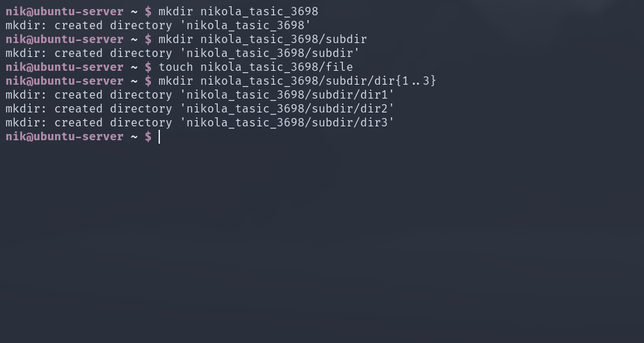
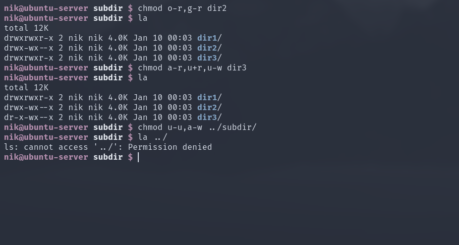
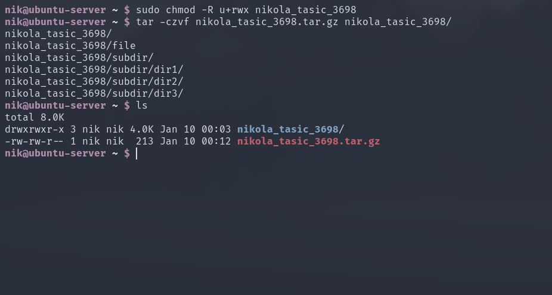
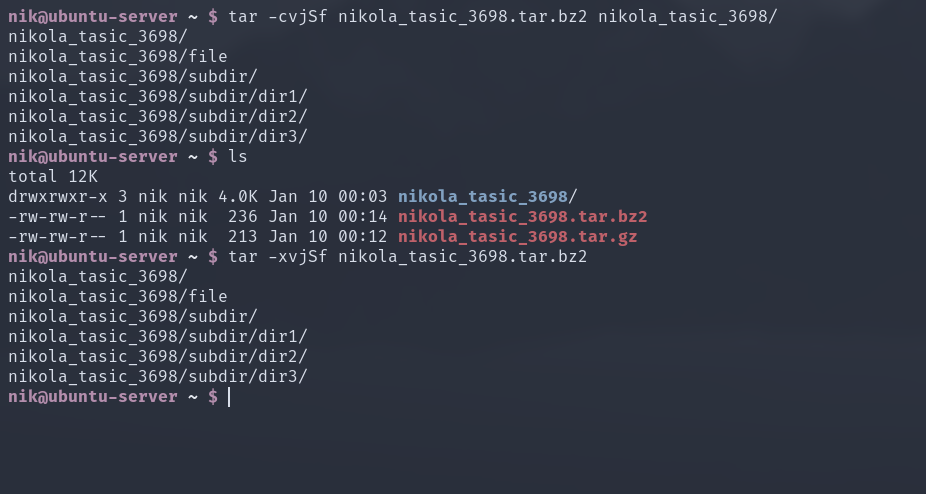
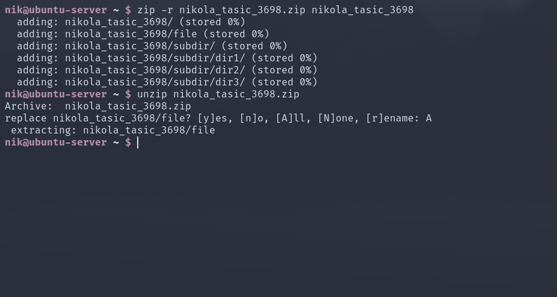

# CS225 DZ04

## Zadatak 1

### Odgovoriti na sledeća pitanja: 
* P1. funkcija exec() vraća samo ako je:
	došlo do greške.
* P2. Naredbe koje se pojavljuju nakon exec() funkcije takođe se izvršavaju - Tačno/Netačno.
	Netačno osim ako nije došlo do greške prilikom poziva `exec(3)`.
* P3. Po čemu se funkcija excel() razlikuje od funkcije system()?
	Funkcija `system(3)` izvršava prosleđeni string u podrazumevanom sistemskom shell-u
	npr. `/bin/sh` koristeći zapravo funkciju `execl(3)` na sledeci način:
	`execl("/bin/sh", "sh", "-c", command, (char *) NULL);` gde je `command` string koji
	je prosleđen u funciju `system(3)`, dok `execl(3)` prima put do programa koa prvi parametar
	i varijabilnu listu argumenata za taj program kao preostale parametre.

## Zadatak 2

## Zadatak 3

