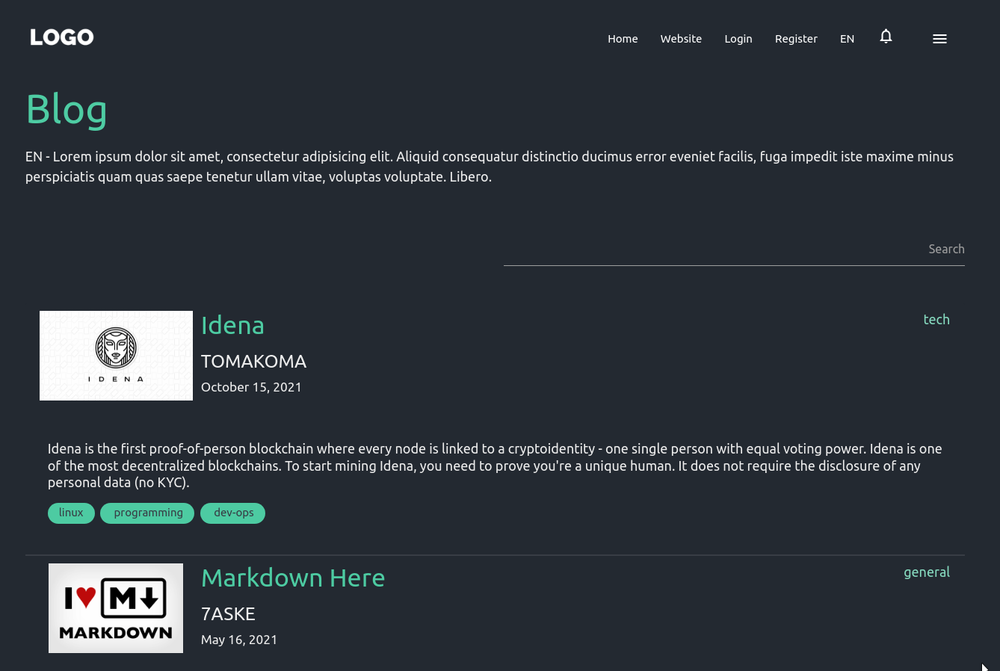
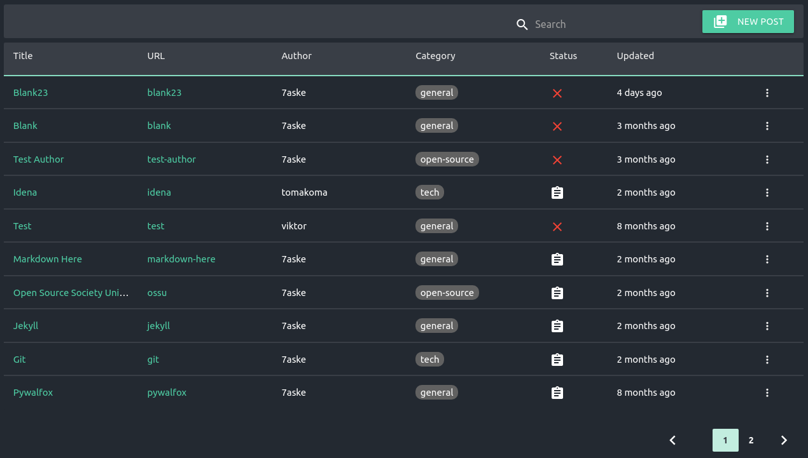
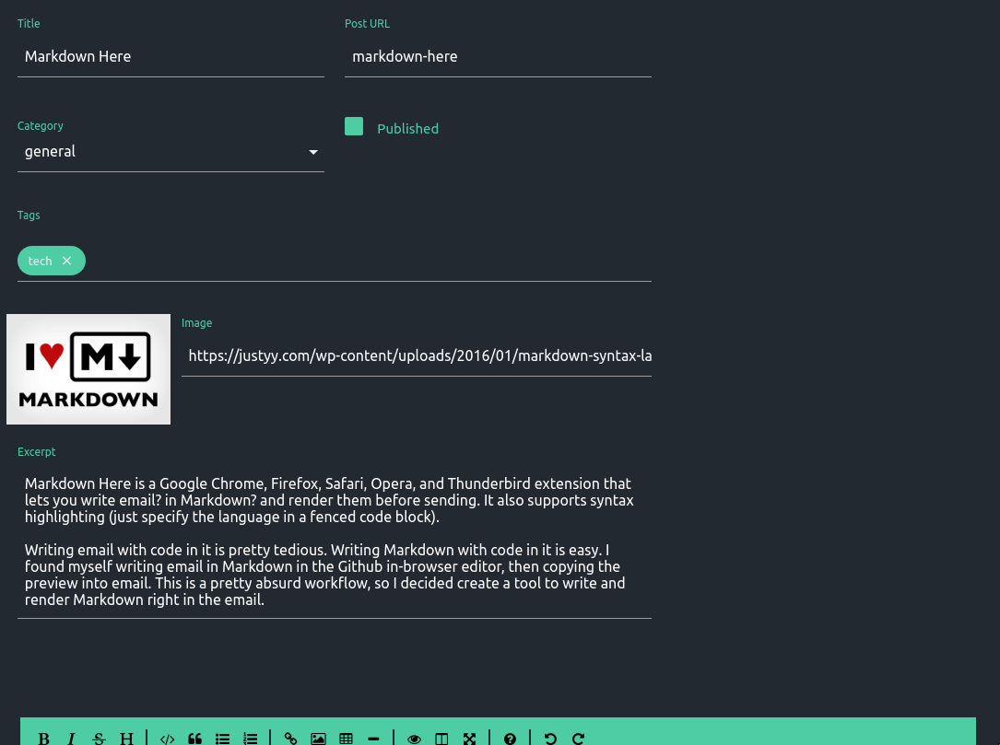

# CS322 Projektni zadatak

Jesenji semetar, 2021/22

Predmet: **CS322: C# Programski jezik**

Profesor: **Miloš Lomović**

Asistent: **Aleksandar Jovanović**

Ime i prezime: **Nikola Tasić**

Broj indeksa: **3698**

Datum izrade: **22.01.2022.**

## Backend blog aplikacije

## 0. Apstrakt

Ideja ovog projekta je izrada backend aplikacije za blog frontend u ASP.NET frejmvorku. Za pomenutu blog aplikaciju već postoji backend API koji je pisan u Spring Boot frameworku i ideja jeste napraviti tako da naša backend aplikacija provajduje idenčan HTTP api tako da frontend aplikacija ne vidi razliku. Obzirom na to da postojeći backend koristi RESTFUL metodologiju dizajna API-ja sve dok god pratimo tu metodologiju(specifkaciju) lako ćemo kreirati interfejs koji će frontend bez ikakvih modifikacija moći da koristi. REST u neku ruku predstavlja loosy-coupling između View i Model/Controller lejera u veb aplikacijama.

## 1. Tehnologije

Za izdradu aplikacije ćemo koristiti ASP.NET Core 6.0 na .NET Core framework-u 6.0. Što se tiče baze koristimo identičnu bazu koju korisiti originalni backend - u pitanju je MariaDB 10.3. Za interakciju sa istom koristićemo Entity Framework 6.0 koji će nam umnogome olašati manipulisanje podacima. Autentikaciju je takođe lako implementirati jer se koristi JWT(JSON Web Token). Za pomoć prilikom izrade projekta koristićemo Swagger za lakšu identifikaciju API endpointa koji implementirani i koje je potrebno implementirati.

## 2. Arhitektura projekta

Projekat ćemo struktuirati po sledećim kategorijama:

* Controller layer

* Service layer

* Modal(DbContext) layer

### Controller layer

Lejer kontrolera predstavlja front-facing api koji naša aplikacija pruža. U kontrolerskim klasama su definisani endpoint-i koji konzumiraju frontend aplikacije.

Primer kontrolerske klase iz ovog projekta bio bi UserController.cs:

```c#
[ApiController]
[Route("users")]
public class UserController : ControllerBase {
	private readonly ILogger<UserController> logger;
	private readonly UserService userService;
	private readonly NotificationService notificationService;
	private readonly IHttpContextAccessor httpContextAccessor;

	public UserController(UserService userService, IHttpContextAccessor httpContextAccessor, ILogger<UserController> logger, NotificationService notificationService) {
		// injection
	}

	[HttpGet]
	public IActionResult get(string? page, string? q) {
		Pageable? pageable = PageableUtil.convert(page);
		PaginatedList<User> users = userService.GetAll(pageable);
		Response.Headers.Add("X-Data-Count", users.TotalCount.ToString());
		return Ok(users);
	}

	[HttpGet("{identifier}")]
	public IActionResult getById(string identifier) {
		return Ok(int.TryParse(identifier, out int val)
			? userService.GetById(val)
			: userService.GetByUsername(identifier));
	}

	[Authorize]
	[HttpGet("notifications")]
	public IActionResult getNotifications(string? page, bool all = false) {
		Pageable? pageable = PageableUtil.convert(page);
		var userId =
			int.Parse(
				httpContextAccessor.HttpContext?.User.FindFirstValue(ClaimTypes
					.NameIdentifier) ?? throw new Exception());
		PaginatedList<Notification> notifications;
		if (all) {
			notifications = notificationService.GetAllByUserId(userId, pageable);
		} else {
			notifications = notificationService.GetAllUnreadByUserId(userId, pageable);
		}

		return Ok(notifications);
	}
	// ... ostali endpointi
}
```

Na ovom primeru vidimo kontrollersku klasu koja provajduje interfejs za izvlačenje individualnih i svih korisnika i notifikacija za ulogovanog korisnika. Identična implementaicija tog interfejsa na originalnom backendu:

```java
@RestController
@RequestMapping("/users")
@RequiredArgsConstructor
public class UserController {
	private final UserService userService;
	private final NotificationService notificationService;

	@AllowAdmin
	@GetMapping
	@ApiOperation(value = "", nickname = "getAllUsers")
	public ResponseEntity<List<User>> getAllUsers(@RequestParam(name = "q", required = false) Specification<User> specification,
	                                              @RequestParam(name = "page", required = false) Pageable pageable
		return ResponseEntity.ok(userService.findAll(specification, sort, pageable));
	}

	@GetMapping("/{identifier}")
	@ApiOperation(value = "", nickname = "getUserById")
	public ResponseEntity<User> getById(@PathVariable String identifier) {
		try {
			return ResponseEntity.ok(userService.findById(Integer.parseInt(identifier)));
		} catch (NumberFormatException e) {
			return ResponseEntity.ok(userService.findByUsername(identifier));
		}
	}

	@GetMapping("/notifications")
	@ApiOperation(value = "", nickname = "getNotificationsForUser")
	public ResponseEntity<List<Notification>> getNotificationsForUser(@AuthenticationPrincipal User user,
	                                                                  @RequestParam(required = false, name = "all") Boolean all,
	                                                                  @RequestParam(name = "page", required = false) Pageable pageable) {
		if (all != null && all)
			return ResponseEntity.ok(notificationService.findAllForUser(user, pageable));
		return ResponseEntity.ok(notificationService.findAllUnreadForUser(user, pageable));
	}
	// ... ostali endpointi
}
```

Obe ove klase provajduju identične endpointe tako da frontend aplikacija neće videti razliku.

### Service layer

Servisni lejer je deo sistema u kome se odvija biznis logika sistema. Biznis logika blog aplikacije je relativno prosta. Servisne klase su deo ASP.NET dependency injection sistema i možemo ih bez problema koristiti u kontrolerskim klasa koristeći injection preko konstruktora kao što smo mogli videti u prethodnom primeru. Servisne klase su "expose"-ovane preko interfejsa koji im odgovaraju tako da u sistemu imamo sledeću hijerarhiju: User -> UserServiceImpl -> UserService -> UserController. Odlučio sam da ne pratim C# konvenciju pisanja interfejsa sa prefiksom "I" jer je po mnogim standardima pisanja čistog koda to loša praksa.

Evo primera servisne klase koja manipuliše objektima User klase:

```c#
public class UserServiceImpl : UserService {
	private readonly AuditableContext context;

	public UserServiceImpl(AuditableContext context) {
		this.context = context;
	}

	public PaginatedList<User> GetAll(Pageable? pageable) {
		return PaginatedList<User>.Create(context.Users, pageable);
	}

	public User GetById(int id) {
		return context.Users.Single(e => e.Id == id);
	}
	
	public User GetByUsername(string username) {
		return context.Users.Single(e => e.Username == username);
	}
	// ostali servisi
}
```

Identična implementacija originalnog backenda:


```java
@Service
@RequiredArgsConstructor
public class UserServiceImpl implements UserService {
	private final UserRepository userRepository;

	@Override
	public List<User> findAll(Pageable pageable) {
		return userRepository.findAll(specification, pageable).toList();
	}

	@Override
	public User findById(Integer userId) {
		return userRepository.findById(userId)
			.orElseThrow(() -> new NoSuchElementException("User.notFound"));
	}

	@Override
	public User findByUsername(String username) {
		return userRepository.findByUsername(username)
			.orElseThrow(() -> new UsernameNotFoundException("User.notFound"));
	}
	// ostali servisi
}
```

Vidimo da postoje jako velike sličnosti između ova dva jezika i ove dve tehnologije.

### Model layer

Lejer modela ili entiteta predstavlja mapiranje tabela iz baze na konkretne objekte klasa koje definišemo u kodu i njihovo manipulisanje. Ovo je naravno mnogo fleksibilniji način programiranja od ručnog pisanja upita. Deklarativnim definisanjem atributa klase na lakši način možemo definisati naše modele i održavati kod u slučaju bilo kakve promene. 

```c#
[Table("user")]
public class User : Auditable {
	[Key, Column("user_id")]
	public int Id { get; set; }

	[Column("username")]
	public string Username { get; set; }

	[JsonIgnore]
	[Column("password")]
	public string? Password { get; set; }

	[Column("email")]
	public string Email { get; set; }

	[Column("first_name")]
	public string FirstName { get; set; }

	[Column("last_name")]
	public string LastName { get; set; }

	[Column("about")]
	public String? About { get; set; }

	[Column("display_name")]
	public string DisplayName { get; set; }
}

```

## Frontend aplikacija

Frontend aplikacija je klasična blog aplikacija koja konzumira REST API. Aplikacija je višekorisnička i omogućava svakom korisniku da kreira sopstvene objave. Korisnici mogu da takođe pišu komentare na objave i korisnici čije su objave će dobiti notifikaciju o tome.


<small>Slika 1 - Blog home strana</small>


<small>Slika 2 - Blog strana sa objavama</small>


<small>Slika 3 - Kreiranje objave</small>

 Naravno naša aplikacija ne implementira 100% API specifikacije originalnog backend-a. Da bi lakše identifikovali servise/endpointe koji fale kreiramo "stub" endpointe koji će nam vraćati `501 Not Implemented` ili `503 Service Unavailable` status kodove na sledeći način:

 ```c#
[HttpGet("summary")]
public IActionResult getSummary() {
	logger.LogWarning("GET /posts/summary Not Implemented");
	return StatusCode(503);
}
```
## Zaključak

Ovaj projekat je bio interesantna vežba adaptiranja novih aplikacija na postojeće sisteme. Obzirom na to da dobar deo programerskih zanimanja obuhvata prepisivanje starih sistema ovo je veoma dobro iskustvo za imati.
