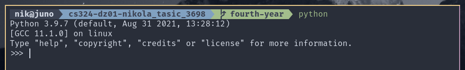

# CS324 DZ01



Program pisan u python-u:

```python
from math import log

num = int(input("Enter a number: "))

log2    = log(2)
log_num = log(num)

res = int(log_num / log2) == (log_num / log2)

print("{} is{} a power of 2".format(num, "" if res else " NOT"))

```

Program pisan u C-u:

```c
#include <stdio.h>
#include <math.h>
#include <stdlib.h>

int main(void) {
        char buf[16];

        printf("Enter a number: ");
        fgets(buf, 16, stdin);
        long num = strtol(buf, NULL, 10);

        double log2    = log(2);
        double log_num = log(num);

        int res = (int)(log_num / log2) == log_num / log2;

        printf("%ld is%s a power of 2\n", num, res ? "" : " NOT");
}
```

## Sličnosti i razlike

Glavne razlike su pre svega u sintaksi. C programski jezik zahteva pokštovanje određene strukture i specificnog načina uvoženja biblioteka. Takođe u C-u moramo da vodimo
računa o tome koje su veličine buffer-i koji se koriste za učitavanje podataka sa komandne linije što nije slučaj u python-u. Pored očiglednih razlika delu za 
učitavanje podataka ostali koraci i implementacija makar za ovaj algoritam su identični.
