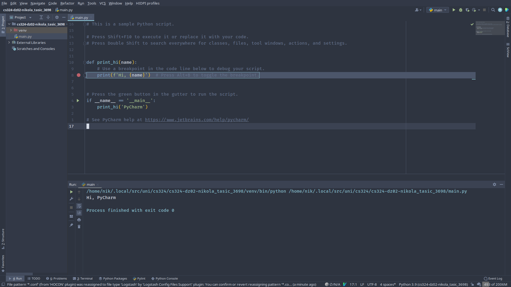

# CS324 DZ02

## Setup



## Task

```python
import math


def is_prime(num: int):
	if not isinstance(num, int):
		raise ValueError

	if num <= 1:
		return False

	if 2 <= num <= 3:
		return True

	for i in range(2, math.ceil(math.sqrt(num)) + 1):
		if num % i == 0:
			return False

	return True


def main():
	for n in range(10000):
		if is_prime(n):
			print(n)


if __name__ == '__main__':
	main()
```