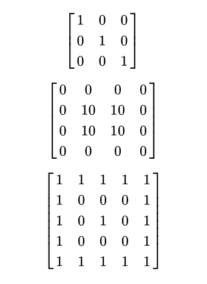

# CS324 DZ08

## Domaći zadatak #1
Korišćenjem numpy paketa napraviti sledeće matrice. Nije dozvoljen ručni unos vrednosti po
indeksu, već treba uneti matricu u matricu:

## Domaći zadatak #2

Napraviti bazu podataka "biblioteka.db", koja sadrži tabelu:
knjige:

(katBroj int, naslov text, izdavac text, godinaIzdavanja int, izdata bool)

Napraviti funkciju za ubacivanja novih knjiga sa konzole. Ubacuje se katBroj, naslov,
izdavac, godinaIzdavanja, a atribut izdat se podrazumevano stavlja na False. Uhvatiti
izuzetak ukoliko je knjiga izdata u budućnosti (proveriti preko datetime paketa).
Napraviti funkciju podesiIzdat(katBroj) koja podešava vrednost izdat i upisuje u bazu novu
vrednost za datu knjigu.
Preko pandas paketa učitati sadržaj tabele knjige. Napraviti novi DataFrame objekat
savremene_knjige koji će sadržati knjige kod kojih je godina izdavanja od 2000. godine.

Upisati u csv datoteku sve knjige koje su izdate u datoteku izdate_knjige.csv sa kolonama
Naslov, izdavac, godinaIzdavanja.