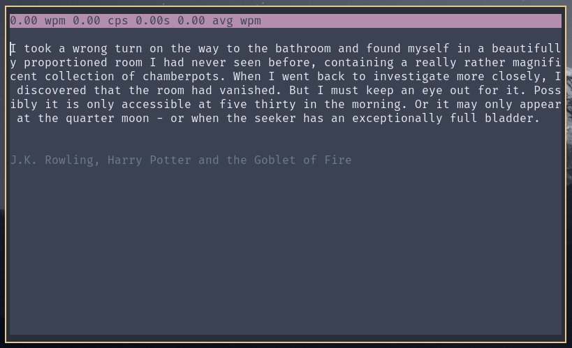

# type-test

## Description

This project is a TypeRacer clone inspired by [cslarsen/wpm](https://github.com/cslarsen/wpm).

## Installation

`python setup.py install`

## Usage

After installing run this in terminal:

`type-test`

## Functionalities

* Tons of quotes shamelessly stolen from [cslarsen/wpm](https://github.com/cslarsen/wpm) which are in turn also [shamelessly](https://github.com/cslarsen/wpm#features) stolen from the original TypeRacer
 
* Measure words per minute(wpm), character per second(cps) and average wpm across multiple sessions.
 
* Valid/invalid text highlighting
 
* Terminal resize handling (buggy)

## Screenshots

## Bugs

* Resizing to less than few columns may cause a crash or a python SEGFAULT

* Sometimes after resizing the typing locks up