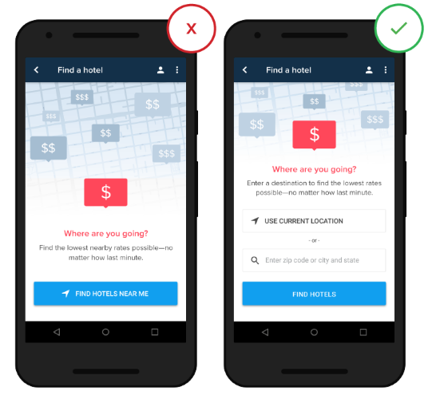

```{css, echo=FALSE}
.section-header {
  font-size: 46px;
  color: #94052d !important;
}

.section-sub-header {
  font-size: 38px;
  font-style: italic;
  color: #94052d !important;
}
```
\
\
\
\
\
\
\
\
\

<div align="center">

 \

## Prolećni semestar, 2019/20
## IT370: INTERAKCIJA ČOVEK-RAČUNAR
## Projektni zadatak
### 

</div>

\
\
\
\
\
\
\
\
\
\
\
\
\
\
\
\
\
\
\
\

### Ime i prezime: **Nikola Tasić**

### Broj indeksa: **3698**

### Datum izrade: **29.06.2020.**

\
\
\
\
\
\
\
\ 

# <span class="section-header">Apstrakt</span>

-----

<font size="5">
**Karma** je mobilna aplikacija koja je predmet ovog projekta i naučnog istraživanja koje ide uz njega.
Naime ova aplikacija ima za ulogu da pruža funkcionalnosti obične To-Do aplikacije sa malim štosom.  

Kao što je rečeno cilj ove aplikacije je da služi kao To-Do App koja ima mogućnost dodavanja, brisanja, označavanja kao urađeno i izmene zadataka koje korisnik sam sebi zadaje i pri tome pomogne u ispunjavanju obaveza ljudima koji zbog same količine istih imaju problema. Takođe ova aplikacija pruža jos jedan tvist u načinu na koji manipulišemo svojim obavezama. **Karma** pruža mogućnost korisnicima da dobijaju poene(karma poene) prilikom ispunjavanja svojih obaveza ali takođe i prilikom neispunjavanja istih stečene poene gube. Korisnik može da se poveže sa različitim društvenim mrežama i na taj način doda svoje prijatelje i poznanike sa kojima može da ima takmičenje u "ispunjavanju" obaveza i svoj napredak upoređuje pomoću zarađenih karma poena.

Obzirom na to da je ciljna grupa aplikacije zauzeti ljudi sa puno obaveza neki od principa razvoja ove aplikacije treba da budu čist korisnički interfejs, smanjenje kognitivnog naprezanja i efikasna navigacija unutar aplikacije.
</font>

# <span class="section-header">Naučno istraživački deo projekta</span>

-----

<font size="5">
U ovom segmentu obradićemo neke od primenjenih metoda da bi se korisnički interfejs što više približio korisničkim potrebama naše ciljne grupe.

Potreba za istraživanjem i usavršavanjem interfejsa je tu sa ciljem da na što bolji način realizuje projekat i plasira aplikaciju na tržište.

Jedan od važnijih fokusa ovog projekta biće kognicija korisnika. Kognicija jeste čovekov doživljaj stvarnosti koji se zasniva na mišljenju i iskustvu. Kognicija je jedinstvena za svakog pojedinca ali mogu se prepoznati određene šeme viđenja realnosti koje su zajedničke. Kognicija takođe obuhvata mentalne procese koji se zasnivaju na zaključivanju, rasuđivanju, moći opažanja, saznanju, itd...
</font>

## <span class="section-sub-header">Kognicija</span>

<font size="5">
Kognitivno naprezanje predstavlja količinu umne snage odnosno razmišljanja koje je potrebno od strane korisnika da bi koristio aplikaciju. Čovekov mozak ima određenu količinu moći procesuiranja a kada aplikacija prezentuje previše informacija odjednom čovek, odnosno korisnik, može da jednostavno odustane od zadatka koji je pred njim.

Što manje vremena korisnik troši na korisnički interfejs to će mu lakše biti da ispuni zadatak koji želi i samim tim će biti zadovoljniji aplikacijom. Naš zadatak kao UI/UX dizajner jeste da korisniku damo jasan put do ostvarenja svog cilja.

Imajući to na umu možemo razmotriti neke od najčešćih metoda za smanjenje kognitivnog naprezanja:

### <font size="6">Smanjenje kognitivnog naprezanja</font>

\

* **Smanjenje vizuelnih prenatrpanosti(clutter)** - nepotrebni linkovi, nerelevantne slike i konfuzni fontovi mogu veoma lako da dovedu do usporavanja korisnika. Vizuelna prenatrpanost je jedan od najvećih problema dobrog dizajna. Prenatrpavajući interfejs povećavamo količinu informacija koje korisnik mora da procesuira a gore smo naveli da je to jedan od uzroka kognitivnog naprezanja. Navešćemo neke od načina da se smanji prenatrpavanje ekrana:

  * Minimalni sadržaj - prikazati korisniku samo ono sto moraju da znaju/vide

  * Minimalni broj elemenata interfejsa - Prost dizajn će učiniti da korisnik se oseća ugodno

  * Koristiti tehniku progresivnog skrivanja informacija - Kada informacije više ne budu potrebne jednostavno ih sakriti od korisnika i tako smanjiti njihovu količinu

<div align="center">

</div>

\

* **Rasterećenje zadataka(offloading)** - Najlakša primena ovog principa je tražiti radnje koje od korisnika zahtevaju napor i naći alternativu. Neki od primera su korišćenje već prikupljenih informacija ili ponuda izbora dobrih podrazumevanih vrednosti.

<div align="center">

</div>

* **Uprošćavanje kompleksnih zadataka** - U slučaju da je zadatak koji korisnik treba da obavi kompleksan ili zahtevi puno koraka veoma je važno razbiti to na manje pod-zadatke koji mnogo lakše stanu operativnu memoriju korisnika. Takođe je veoma važno da korisnik dobije određeni osećaj ostvarenja kada završi pod-zadatak. Neki od primera ovog principa su koraci prilikom naručivanja proizvoda iz aplikacije ili preko interneta.

<div align="center">

</div>

* **Korišćenje sličnih ekrana** - Prilikom korišćenja aplikacije važno je održati konzistenciju interfejsa koji je prikazan korisniku. U slučaju da se prilikom prelaska sa jednog koraka na drugi u toku rešavanja nekog zadatka izgubi ta konzistencija korisnik može da izgubi kognitivni fokus i samim tim dođe do povećanja kognitivnog naprezanja da bi se taj fokus ponovo uspostavio.

* **Smanjiti korisnički unos** - Kucanje na mobilnom telefonu nije zabavno iskustvo i treba smanjiti količinu informacija koje korisnik treba da unese. Već smo naveli da je potrebno pružiti podrazumevane vrednosti da bu se smanjio kognitivno naprezanja. Takođe previše informacija koje korisnik treba da unese dovode do grešaka. Takođe treba primeniti neke od narednih tehnika ako je to moguće:

  * Smanjiti veličinu formi gde je to moguće. Skloniti nepotrebna polja i smanjiti količinu informacija koje korisnik treba da unese.

  * Koristiti maske za polja za unos. Na primer prilikom unosa broja telefona ili adrese nije loše prikazati korisniku maskirani format u kome bi trebalo da unese podatke. Na taj način korisnik dobija osećaj sigurnosti da je uneo validne podatke.

  * Koristiti pametne opcije. Jedan od primera pametnih opcija je autocomplete. Autocomplete olakšava i ubrzava popunjavanje formi. Najprostiji primer je autocomplete e-mail adrese sa propratnim sačuvanim informacijama kao i geolokacija.

  * Dinamički proveravati validnost podataka. Veoma je frustrirajuće vratiti se nazad posle unosa nevalidne forme i ispravljati greške. Validirati polja dinamički u realnom vremenu gde god je to moguće.

  * Prilagoditi tastaturu unosnom polju. Ako se od korisnika zahteva da unese samo brojeve u polje prikazati mu isključivo numeričku tastaturu.

<div align="center">

</div>

</font>

## <span class="section-sub-header">Analiza korisnika sistema</span>

<font size="5">

Za uspešno i efikasno razvijanje aplikacije neophodno je napraviti studiju podataka prikupljenih o korisnicima aplikacije. Analiza podataka svih korisnika ne mora uvek da pruži validne podatke i zbog toga bi trebalo da grupišemo korisnike u ciljne grupe na osnovu nekih logičnih kriterijuma (na primer starost, poznavanje informacionih tehnologija, iskustvo u korišćenju mobilnog telefona i drugi). Sada kada smo podelili korisnike u ciljne grupe možemo lakše da sprovedemo istraživanje i razvoj na osnovi potreba svake od ciljnih grupa.

Za prikupljanje informacija koristimo standardne metode kao što su anketa i intervju, s tim što je intervju direktniji pristup. Oba metoda se mogu izvesti u pisanoj ili usmenoj formi. Informacije možemo prikupiti na ulici, radnom mestu, ili bilo kom drugom mestu a takođe i preko interneta. Prilikom prikupljanja informacija moramo uzeti obzir standardne faktore koji mogu uticati na informacije koje ispitanici pružaju kao što su na primer okruženje, prethodno iskustvo i znanje, i slično. Takođe postoje alternativni načini prikupljanja informacija kao što su recenzije već postojećih aplikacija. Pružićemo kratke opise navedenih metoda:

* **Anketa** - Sastoji se od skupa pitanja koja mogu biti otvorenog ili zatvorenog tipa. Pitanja otvorenog tipa su znatno teža za analizu jer ispitanik ima potpunu slobodu izražavanja ali zato pružaju mnogo bolji uvid u razmišljanje ispitanika od pitanja zatvorenog tipa. Pitanja zatvorenog tipa imaju odgovarajući skup odgovora koje ispitanik može da izabere i zbog toga pružaju mnogo efikasniju obradu dobijenih informacija.

* **Intervju** - Obuhvata pitanja zatvorenog i otvorenog tipa i ne razlikuje se mnogo od ankete. Intervju se takođe može sprovesti usmeni ili pismeno. U zavisnosti od pitanja ispitanik može da obrazloži svoj odgovor što identično kao i u slučaju sa anketom otvorenog tipa dovodi do problema prilikom analize prikupljenih informacija.  

* **Recenzije** - Zahvaljujući dostupnosti aplikacija na internetu često možemo naći aplikacije sličnih našoj i na osnovu komentara, ocena i recenzija korisnika tih aplikacija možemo doći do važnih informacija o tome kako treba da unapredimo naš dizajn.

</font>

## <span class="section-sub-header">Testiranje korisničkog interfejsa</span>

\

<font size="5">

Za testiranje korisničkog interfejsa možemo koristiti više različitih metoda. Pod testiranjem korisničkog interfejsa podrazumevamo testiranje korisničkog iskustva a ne integraciono ili jedinično testiranje same aplikacije tj. njenog programskog dela. Pre testiranja moramo naravno imati prototip aplikacije koju želimo da testiramo. Na prototipu kao i na gotovoj aplikaciji moramo izvršiti optimizaciju zadataka odnosno dubinu svakog individualnog važnijeg zadatka dovesti do najviše tri koraka. Ovaj postupak takođe smanjuje kognitivno naprezanje o kome smo već govorili. Što se tiče metoda testiranja možemo razlikovati dva osnovna tipa:

* **Metoda posmatranja**

* **Metoda heurističke analize**

Najvažnije je da prilikom testiranja prepustimo korisnika bez ikakvih sugerisanja da sam interaguje sa korisničkim interfejsom. Nadamo se da će korisnik svojom intuicijom zaključiti kako se interfejs koristi i u tim slučaju osnovni kriterijum testiranja je zadovoljen. Ova metoda naravno sama po sebi neće pružiti korisne informacije ako ih mi ne prikupimo. Jedne od metoda ovakvog prikupljanja informacija su *Heatmap* i *Eyetracker*. U opštem smislu Heatmap predstavlja bojom označen region neke najveće aktivnosti a u našem slučaju može predstavljati najviše dodira osetljivog ekrana. Na sličan način Eyetracker nam može dati uvid to koji regioni našeg interfejsa su najinteresantniji korisniku. 

\
\
\

* **Heatmap** - je način posmatranja korisnika koji beleži koliko često je korisnik posetio odnosno kliknuo na određenu oblast ekrana. Oblasti su zatim obojene različitim bojama u zavisnosti od broja interakcija. Na slici ispod vidimo primer Heatmap-a.

\
\
\

<div align="center">

</div>

\
\
\
\
\

* **Eyetracker** - nam pruža mogućnost da pomoću kamere snimimo pokrete oka korisnika i samim tim zaključimo gde najveći fokus u našoj aplikaciji. Na ovaj način dobijamo informaciju koji delovi korisničkog interfejsa najviše interesuju korisnika. Ovaj vid testiranja je dosta napredniji od Heatmap-a.

\
\
\

<div align="center">

</div>

</font>
