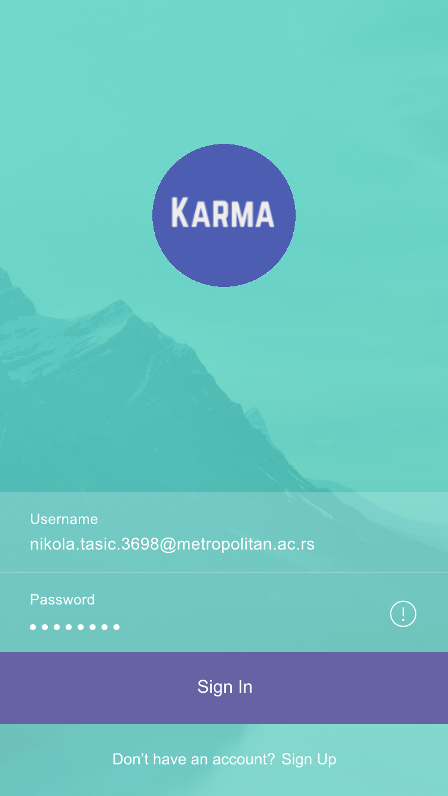
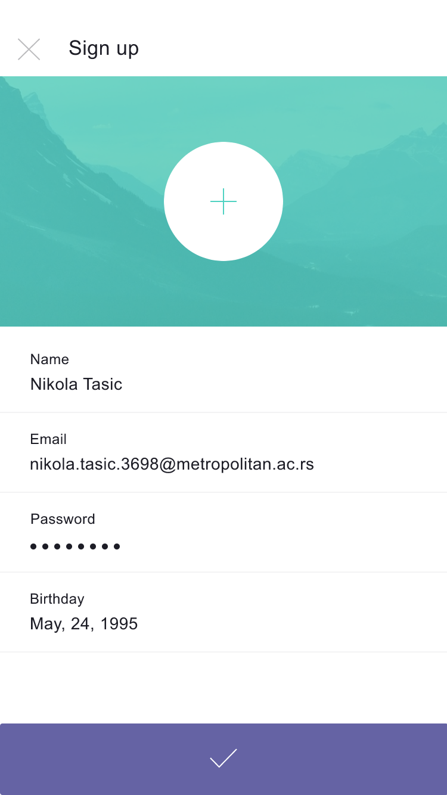
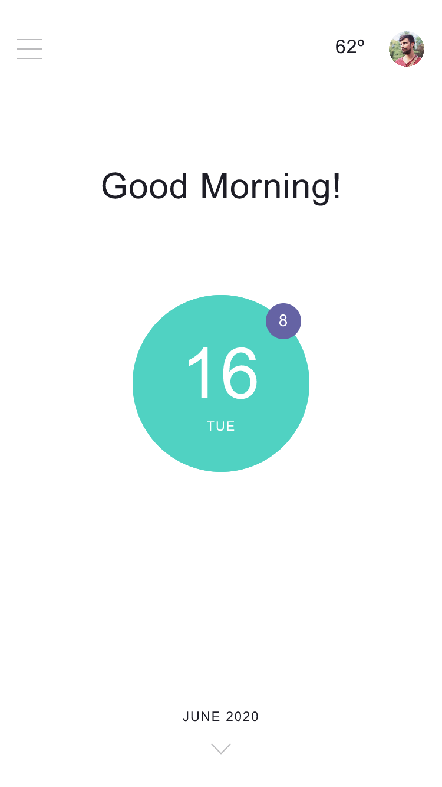
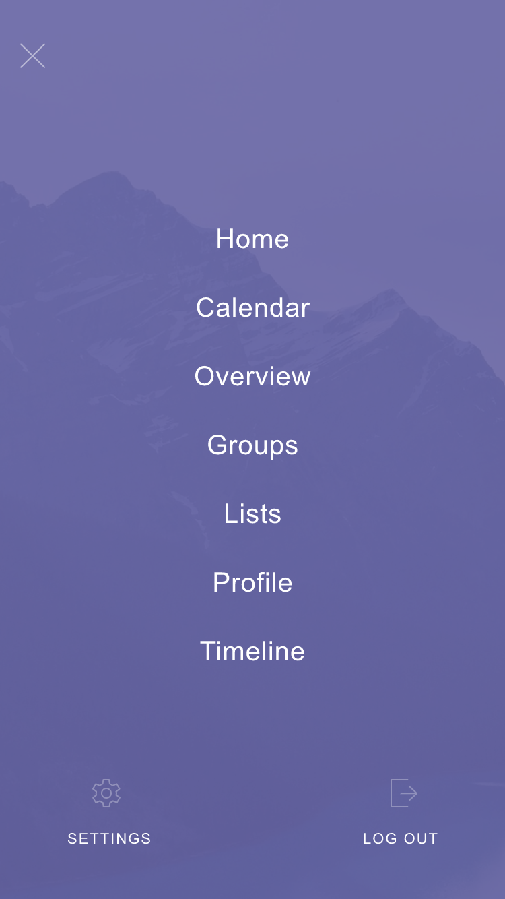
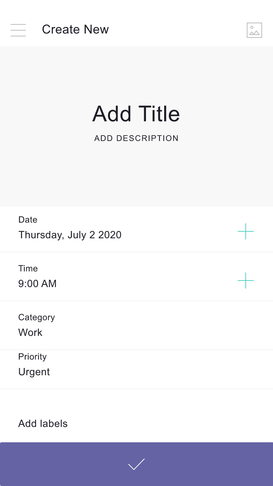
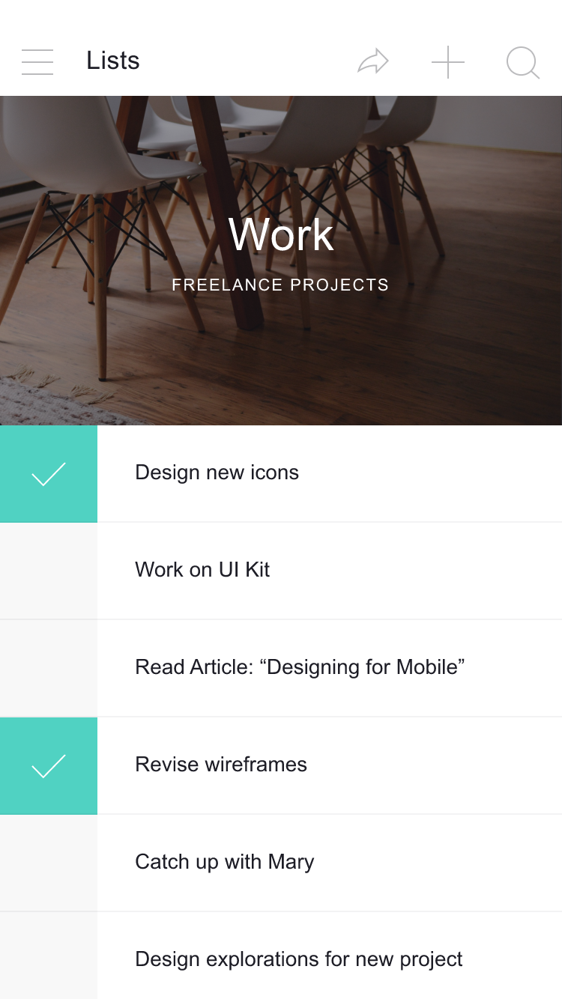
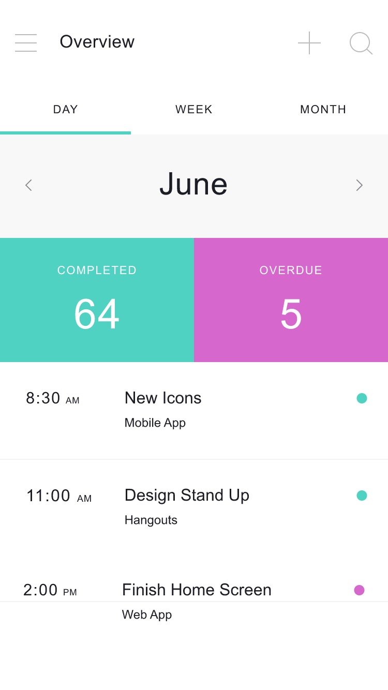
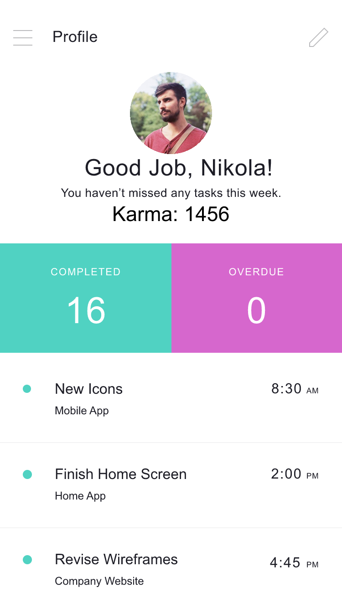
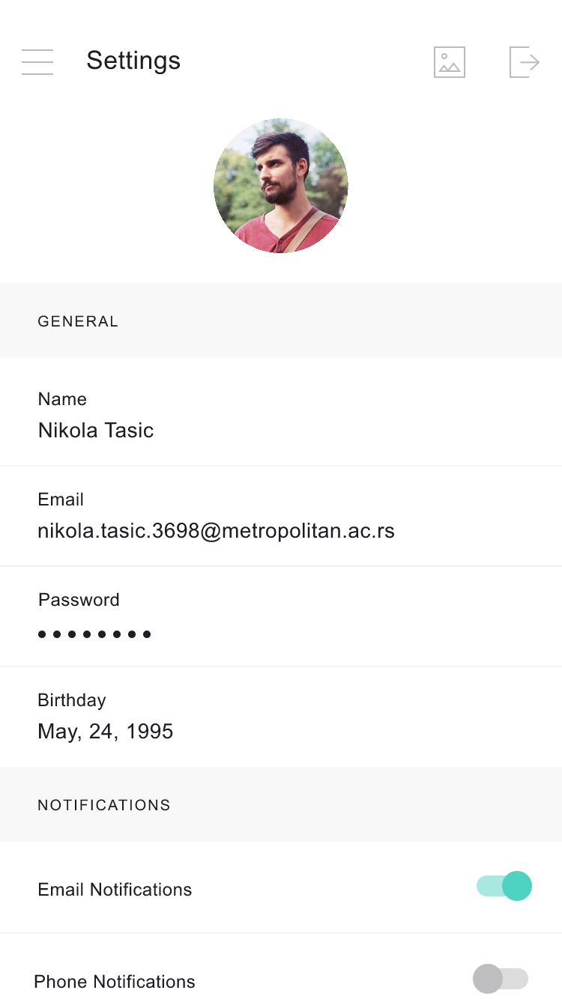

```{css, echo=FALSE}
.section-header {
  font-size: 46px;
  color: #94052d !important;
}

.section-sub-header {
  font-size: 38px;
  font-style: italic;
  color: #94052d !important;
}
.impl-img img {
  width: 350px;
}
```
\
\
\
\
\
\
\
\
\

<div align="center">

 \

## Prolećni semestar, 2019/20
## IT370: INTERAKCIJA ČOVEK-RAČUNAR
## Projektni zadatak
### 

</div>

\
\
\
\
\
\
\
\
\
\
\
\
\
\
\
\
\
\
\
\

### Ime i prezime: **Nikola Tasić**

### Broj indeksa: **3698**

### Datum izrade: **29.06.2020.**

\
\
\
\
\
\
\
\ 

# <span class="section-header">Apstrakt</span>

-----

<font size="5">
**Karma** je mobilna aplikacija koja je predmet ovog projekta i naučnog istraživanja koje ide uz njega.
Naime ova aplikacija ima za ulogu da pruža funkcionalnosti obične To-Do aplikacije sa malim štosom.  

Kao što je rečeno cilj ove aplikacije je da služi kao To-Do App koja ima mogućnost dodavanja, brisanja, označavanja kao urađeno i izmene zadataka koje korisnik sam sebi zadaje i pri tome pomogne u ispunjavanju obaveza ljudima koji zbog same količine istih imaju problema. Takođe ova aplikacija pruža jos jedan tvist u načinu na koji manipulišemo svojim obavezama. **Karma** pruža mogućnost korisnicima da dobijaju poene(karma poene) prilikom ispunjavanja svojih obaveza ali takođe i prilikom neispunjavanja istih stečene poene gube. Korisnik može da se poveže sa različitim društvenim mrežama i na taj način doda svoje prijatelje i poznanike sa kojima može da ima takmičenje u "ispunjavanju" obaveza i svoj napredak upoređuje pomoću zarađenih karma poena.

Obzirom na to da je ciljna grupa aplikacije zauzeti ljudi sa puno obaveza neki od principa razvoja ove aplikacije treba da budu čist korisnički interfejs, smanjenje kognitivnog naprezanja i efikasna navigacija unutar aplikacije.
</font>

# <span class="section-header">Naučno istraživački deo projekta</span>

-----

<font size="5">
U ovom segmentu obradićemo neke od primenjenih metoda da bi se korisnički interfejs što više približio korisničkim potrebama naše ciljne grupe.

Potreba za istraživanjem i usavršavanjem interfejsa je tu sa ciljem da na što bolji način realizuje projekat i plasira aplikaciju na tržište.

Jedan od važnijih fokusa ovog projekta biće kognicija korisnika. Kognicija jeste čovekov doživljaj stvarnosti koji se zasniva na mišljenju i iskustvu. Kognicija je jedinstvena za svakog pojedinca ali mogu se prepoznati određene šeme viđenja realnosti koje su zajedničke. Kognicija takođe obuhvata mentalne procese koji se zasnivaju na zaključivanju, rasuđivanju, moći opažanja, saznanju, itd...
</font>

## <span class="section-sub-header">Kognicija</span>

<font size="5">
Kognitivno naprezanje predstavlja količinu umne snage odnosno razmišljanja koje je potrebno od strane korisnika da bi koristio aplikaciju. Čovekov mozak ima određenu količinu moći procesuiranja a kada aplikacija prezentuje previše informacija odjednom čovek, odnosno korisnik, može da jednostavno odustane od zadatka koji je pred njim.

Što manje vremena korisnik troši na korisnički interfejs to će mu lakše biti da ispuni zadatak koji želi i samim tim će biti zadovoljniji aplikacijom. Naš zadatak kao UI/UX dizajner jeste da korisniku damo jasan put do ostvarenja svog cilja.

Imajući to na umu možemo razmotriti neke od najčešćih metoda za smanjenje kognitivnog naprezanja:

### <font size="6">Smanjenje kognitivnog naprezanja</font>

\

* **Smanjenje vizuelnih prenatrpanosti(clutter)** - nepotrebni linkovi, nerelevantne slike i konfuzni fontovi mogu veoma lako da dovedu do usporavanja korisnika. Vizuelna prenatrpanost je jedan od najvećih problema dobrog dizajna. Prenatrpavajući interfejs povećavamo količinu informacija koje korisnik mora da procesuira a gore smo naveli da je to jedan od uzroka kognitivnog naprezanja. Navešćemo neke od načina da se smanji prenatrpavanje ekrana:

  * Minimalni sadržaj - prikazati korisniku samo ono sto moraju da znaju/vide

  * Minimalni broj elemenata interfejsa - Prost dizajn će učiniti da korisnik se oseća ugodno

  * Koristiti tehniku progresivnog skrivanja informacija - Kada informacije više ne budu potrebne jednostavno ih sakriti od korisnika i tako smanjiti njihovu količinu

<div align="center">

</div>

\

* **Rasterećenje zadataka(offloading)** - Najlakša primena ovog principa je tražiti radnje koje od korisnika zahtevaju napor i naći alternativu. Neki od primera su korišćenje već prikupljenih informacija ili ponuda izbora dobrih podrazumevanih vrednosti.

<div align="center">

</div>

* **Uprošćavanje kompleksnih zadataka** - U slučaju da je zadatak koji korisnik treba da obavi kompleksan ili zahtevi puno koraka veoma je važno razbiti to na manje pod-zadatke koji mnogo lakše stanu operativnu memoriju korisnika. Takođe je veoma važno da korisnik dobije određeni osećaj ostvarenja kada završi pod-zadatak. Neki od primera ovog principa su koraci prilikom naručivanja proizvoda iz aplikacije ili preko interneta.

<div align="center">

</div>

* **Korišćenje sličnih ekrana** - Prilikom korišćenja aplikacije važno je održati konzistenciju interfejsa koji je prikazan korisniku. U slučaju da se prilikom prelaska sa jednog koraka na drugi u toku rešavanja nekog zadatka izgubi ta konzistencija korisnik može da izgubi kognitivni fokus i samim tim dođe do povećanja kognitivnog naprezanja da bi se taj fokus ponovo uspostavio.

* **Smanjiti korisnički unos** - Kucanje na mobilnom telefonu nije zabavno iskustvo i treba smanjiti količinu informacija koje korisnik treba da unese. Već smo naveli da je potrebno pružiti podrazumevane vrednosti da bu se smanjio kognitivno naprezanja. Takođe previše informacija koje korisnik treba da unese dovode do grešaka. Takođe treba primeniti neke od narednih tehnika ako je to moguće:

  * Smanjiti veličinu formi gde je to moguće. Skloniti nepotrebna polja i smanjiti količinu informacija koje korisnik treba da unese.

  * Koristiti maske za polja za unos. Na primer prilikom unosa broja telefona ili adrese nije loše prikazati korisniku maskirani format u kome bi trebalo da unese podatke. Na taj način korisnik dobija osećaj sigurnosti da je uneo validne podatke.

  * Koristiti pametne opcije. Jedan od primera pametnih opcija je autocomplete. Autocomplete olakšava i ubrzava popunjavanje formi. Najprostiji primer je autocomplete e-mail adrese sa propratnim sačuvanim informacijama kao i geolokacija.

  * Dinamički proveravati validnost podataka. Veoma je frustrirajuće vratiti se nazad posle unosa nevalidne forme i ispravljati greške. Validirati polja dinamički u realnom vremenu gde god je to moguće.

  * Prilagoditi tastaturu unosnom polju. Ako se od korisnika zahteva da unese samo brojeve u polje prikazati mu isključivo numeričku tastaturu.

<div align="center">

</div>

</font>

## <span class="section-sub-header">Analiza korisnika sistema</span>

<font size="5">

Za uspešno i efikasno razvijanje aplikacije neophodno je napraviti studiju podataka prikupljenih o korisnicima aplikacije. Analiza podataka svih korisnika ne mora uvek da pruži validne podatke i zbog toga bi trebalo da grupišemo korisnike u ciljne grupe na osnovu nekih logičnih kriterijuma (na primer starost, poznavanje informacionih tehnologija, iskustvo u korišćenju mobilnog telefona i drugi). Sada kada smo podelili korisnike u ciljne grupe možemo lakše da sprovedemo istraživanje i razvoj na osnovi potreba svake od ciljnih grupa.

Za prikupljanje informacija koristimo standardne metode kao što su anketa i intervju, s tim što je intervju direktniji pristup. Oba metoda se mogu izvesti u pisanoj ili usmenoj formi. Informacije možemo prikupiti na ulici, radnom mestu, ili bilo kom drugom mestu a takođe i preko interneta. Prilikom prikupljanja informacija moramo uzeti obzir standardne faktore koji mogu uticati na informacije koje ispitanici pružaju kao što su na primer okruženje, prethodno iskustvo i znanje, i slično. Takođe postoje alternativni načini prikupljanja informacija kao što su recenzije već postojećih aplikacija. Pružićemo kratke opise navedenih metoda:

* **Anketa** - Sastoji se od skupa pitanja koja mogu biti otvorenog ili zatvorenog tipa. Pitanja otvorenog tipa su znatno teža za analizu jer ispitanik ima potpunu slobodu izražavanja ali zato pružaju mnogo bolji uvid u razmišljanje ispitanika od pitanja zatvorenog tipa. Pitanja zatvorenog tipa imaju odgovarajući skup odgovora koje ispitanik može da izabere i zbog toga pružaju mnogo efikasniju obradu dobijenih informacija.

* **Intervju** - Obuhvata pitanja zatvorenog i otvorenog tipa i ne razlikuje se mnogo od ankete. Intervju se takođe može sprovesti usmeni ili pismeno. U zavisnosti od pitanja ispitanik može da obrazloži svoj odgovor što identično kao i u slučaju sa anketom otvorenog tipa dovodi do problema prilikom analize prikupljenih informacija.  

* **Recenzije** - Zahvaljujući dostupnosti aplikacija na internetu često možemo naći aplikacije sličnih našoj i na osnovu komentara, ocena i recenzija korisnika tih aplikacija možemo doći do važnih informacija o tome kako treba da unapredimo naš dizajn.

</font>

## <span class="section-sub-header">Testiranje korisničkog interfejsa</span>

\

<font size="5">

Za testiranje korisničkog interfejsa možemo koristiti više različitih metoda. Pod testiranjem korisničkog interfejsa podrazumevamo testiranje korisničkog iskustva a ne integraciono ili jedinično testiranje same aplikacije tj. njenog programskog dela. Pre testiranja moramo naravno imati prototip aplikacije koju želimo da testiramo. Na prototipu kao i na gotovoj aplikaciji moramo izvršiti optimizaciju zadataka odnosno dubinu svakog individualnog važnijeg zadatka dovesti do najviše tri koraka. Ovaj postupak takođe smanjuje kognitivno naprezanje o kome smo već govorili. Što se tiče metoda testiranja možemo razlikovati dva osnovna tipa:

* **Metoda posmatranja**

* **Metoda heurističke analize**

Najvažnije je da prilikom testiranja prepustimo korisnika bez ikakvih sugerisanja da sam interaguje sa korisničkim interfejsom. Nadamo se da će korisnik svojom intuicijom zaključiti kako se interfejs koristi i u tim slučaju osnovni kriterijum testiranja je zadovoljen. Ova metoda naravno sama po sebi neće pružiti korisne informacije ako ih mi ne prikupimo. Jedne od metoda ovakvog prikupljanja informacija su *Heatmap* i *Eyetracker*. U opštem smislu Heatmap predstavlja bojom označen region neke najveće aktivnosti a u našem slučaju može predstavljati najviše dodira osetljivog ekrana. Na sličan način Eyetracker nam može dati uvid to koji regioni našeg interfejsa su najinteresantniji korisniku. 

\
\
\

* **Heatmap** - je način posmatranja korisnika koji beleži koliko često je korisnik posetio odnosno kliknuo na određenu oblast ekrana. Oblasti su zatim obojene različitim bojama u zavisnosti od broja interakcija. Na slici ispod vidimo primer Heatmap-a.

\
\
\

<div align="center">

</div>

\
\
\
\
\

* **Eyetracker** - nam pruža mogućnost da pomoću kamere snimimo pokrete oka korisnika i samim tim zaključimo gde najveći fokus u našoj aplikaciji. Na ovaj način dobijamo informaciju koji delovi korisničkog interfejsa najviše interesuju korisnika. Ovaj vid testiranja je dosta napredniji od Heatmap-a.

\
\
\

<div align="center">

</div>

</font>

# <span class="section-header">Dizajn</span>


## <span class="section-sub-header">Opis aplikacije</span>

<font size="5">

Zbog ubrzanog načina života u današnjem vremenu dolazi do situacija gde veoma često zaboravljamo važne stvari. Kod nekoga su u pitanju poslovne obaveze dok kod drugih mogu da budu razni događaji svojih bližnjih i slično. Kod nekog možda nije slučaj zaboravljanje nego jednostavno prevelika količina obaveza ili jednostavno želja da se izvuče maksimum iz sebe. U bilo kom slučaju u modernom vremenu mobilne i web aplikacije su postale de facto najbolji alat u mnogim sferama naših zivota. Od plaćanja računa preko komunikacije sa drugim ljudima do naručivanja hrane i još mnogih drugih primena. U suštini retko ko u sadašnjici nema pristup mobilnom telefonu ili računaru i gotovo svakodnevno konzumira makar jednu ili, često, desetine aplikacija prilikom svakodnevnih aktivnosti. Naravno naveden aplikacije, naravno izuzev onih za zabavu, imaju za svrhu da olakšaju ili ubrzaju svakodnevne poslove i time "kupe" više vremena.

**Karma** je aplikacija koja upravo rešava mnoge od ovih problema. Ona pruža interfejs za lako unošenje, pregled i manipulisanje obavezama i zadacima koji će gotovo svakome biti od velikog značaja. Korisnik aplikacije ima mogućnost dodavanja obaveza bez prethodne registracije jer je zaključeno iz istraživanja da mnogi korisnici prilikom prve potrebe da se uloguju kod nove nepoznate aplikacije istu napuštaju u potrazi za novom. Tako da je odlučeno da osnovna funkcionalnost, odnosno manipulacija obaveza, ne bude ograničena potrebom da se korisnik uloguje.

Dakle korisnik ima mogućnost da:

* Dodaje zadatke

	Zadatak moze da sadrži:
	* Kratak opis	
	* Duži opis
	* Kategoriju
	* Datum izvršenja
	* Prioritet
	* Labele

* Briše zadatke
* Menja zadatke
* Označava zadatke kao izvršene
* Arhivira zadatke
* Sortira i pregleda sve zadatke po raznim kriterijumima

Registracijom korisnik dobija mogućnost da:

* Menja, briše i dodaje kategorije i labele
* Podešava notifikacije i obaveštenja koja mu stižu putem mejla ili na telefonu
* *Karma* bodovni sistem
* Povezivanje sa prijateljima koji su korisnici aplikacije
* Dodaju grupne zadatke povezanim prijateljima
* Sinhronizacija 


### <font size="6">Kategorije i labele</font>

Bez logovanja korisnik ima neke osnovne kategorije pomoću kojih može lakše da organizuje svoje zadatke. Neke od kategorija su: *work*, *school*, *friends and family*, *personal*, *health*... Ulogovani korisnik ima mogućnost da menja postojeće kategorije i dodaje nove i one se čuvaju u njegovom nalogu. Slična situacija je i sa labelama koje mogu imati dodatne opise kao i boje koje će vizuelno razlikovati različite zadatke u samoj aplikaciji. Naravno obe ove opcija znatno pomažu pri pregledu i sortiranju.

### <font size="6">Ciljne grupe</font>

Ciljne grupe ove aplikacije mogu da pripadaju gotovo bilo kom životnom dobu ali prevashodno su targetirani ljudi bilo kog pola od 16 do 45 godina. Ovu ciljnu grupu takođe treba da karakteriše osnovno poznavanje mobilnih aplikacija jer ova aplikacija treba da im pomogne u životu punom obaveza a ne da pruži jos jednu stvar koju moraju naučiti kako da koriste.

Kao što je već pomenuto targetirani su pojedinci koji imaju problema sa organizacijom vremena da li zbog lične nemogućnosti da se sami organizuju ili zbog jednostavno prevelike količine obaveza koje imaju pred sobom.
</font>

# <span class="section-header">Implementacija i testiranje</span>

## <span class="section-sub-header">Implementacija</span>

<font size="5">
Mockup ove aplikacije je odrađen u Invision okurženju. U nastavku ćemo proći kroz najosnovnije ekrane koji su dostupni korisniku.

\
\
\
\
\
\
\
\
\
\
\
\
\
\
\
\
\
\
\
\
\

### <font size="6">Login</font>

<div align="center" class="impl-img">

</div>

\

Na slici 1 vidimo login ekran aplikacije. Nema previše neuobičajnih elemenata na ovoj strani tako da idemo dalje ka registraciji kojoj se može pristupiti dodirom na tekst "Sign up". Napominjemo da ovo nije početni ekran aplikacije iz razloga koje smo naveli u segmentu gde smo opisivali rezultate istraživanja.

\
\
\
\
\
\
\
\
\
\
\
\
\
\

### <font size="6">Registracija</font>

<div align="center" class="impl-img">

</div>

\

Slika 2 prikazuje ekran za registraciju (Sign Up) sa najosnovnijim podacima. Korisnik pruža samo osnovne podatke o sebi.


\
\
\
\
\
\
\
\
\
\
\
\
\
\
\
\
\

### <font size="6">Početni ekran</font>

<div align="center" class="impl-img">

</div>

\

Slika 3 prikazuje početni ekran koji pokazuje datum i u gornjem desnom uglu trenutnu temperaturu. Korisnik dalje korišćenje aplikacije nastavlja vertikalnim povlačenjem ekrana i dodirom na ikonicu menija u gornjem levom uglu.

\
\
\
\
\
\
\
\
\
\
\
\
\
\
\
\

### <font size="6">Glavni Meni</font>

<div align="center" class="impl-img">

</div>

\

Kao što vidimo na slici 4 se nalazi glavni meni aplikacije sa svim dostupnim funkcionalnostima.

\
\
\
\
\
\
\
\
\
\
\
\
\
\
\
\
\

### <font size="6">Kategorije</font>

<div align="center" class="impl-img">

</div>

\

Ovde vidimo neke od dodatih kategorija. Kao što smo naveli korisnik ima mogućnosti veće personalizacije tek da se uloguje jer želimo da te podatke sačuvamo i sinhronizujemo sa više uređaja.

\
\
\
\
\
\
\
\
\
\
\
\
\
\
\
\

### <font size="6">Kreiranje i lista zadataka</font>

<table>
<tr>
<td align="center">

<div align="center" class="impl-img">

</div>
</td>
<td align="center">
<div align="center" class="impl-img">

</div>
</td>
</table>
</tr>

\

Na ekranu na slici 6 vidimo postavku forme za kreiranje zadatka. Korisnik ovde bira opcije kao što su: 

* Naslov
* Opis
* Predviđeni rok izvršenja zadatka
* Kategoriju
* Prioritet
* Labele

Po unosu zadatak se dodaje na listu zadataka (Slika 7). Na navedenoj slici je prikazana lista zadataka za kategoriju "Work".

\
\
\
\
\
\
\
\

### <font size="6">Mesečni pregled</font>

<div align="center" class="impl-img"></div>

\

Slika 8 prikazuje mesečni pregled izvršenih i zakasnelih zadataka takođe. Korisnik može pored trenutnog meseca da pogleda stanja prethodnih meseci.

\
\
\
\
\
\
\
\
\
\
\
\
\
\
\
\
\
\

### <font size="6">Profil</font>

<div align="center" class="impl-img">

</div>

\

Na ovom ekranu prikazanom na slici 9 vidimo pregled profila korisnika. Takođe prikazani su najskoriji zadaci kao i pregled zadataka za trenutni mesec (izvršeni na vreme i neizvršeni na vreme). Pored tih informacija vidimo koliko je "Karma" poena korisnik ostvario izvršavanjem zadataka na vreme.

\
\
\
\
\
\
\
\
\
\
\
\
\
\

### <font size="6">Podešavanja</font>

<div align="center" class="impl-img">

</div>

\

Slika 10 prikazuje ekran na kome imamo pristup izmeni osnovnih podataka. Pored izmene podataka imamo i opciju uključivanja i isključivanja e-mail i notifikacija telefona.

</font>

## <span class="section-sub-header">Testiranje</span>

<font size="5">

Kontinualno testiranje aplikacije u svakoj iteraciji razvoja je ključ uspešnosti ovog projekta. Na osnovu prethodnih analiza ciljnih grupa možemo relativno lako do prvog prototipa aplikacije. Prvi prototip je u suštini aplikacija izrađena na osnovnu potreba i sposobnosti analiziranih ciljnih grupa. Po razvoju prvog prototipa menja se sam pristup jer počevši s ovom verzijom će se primenjivati Test-Driven Development odnosno TDD. TDD predstavlja model razvoja koji na kraju svake nove iteracije (verzije) proizvoda primenjuje isti set evaluacija od strane ciljnih grupa kako bi se on što bolje prilagodio njihovim potrebama i sposobnostima. Analiza rezultata dobijenih ovim testiranjem znatno povećava efikasnost razvoja aplikacije jer direktno ukazuje na probleme u dizajnu ili korisničkom iskustvu. 

\
\
\
\

Neki od testova koje ćemo primenjivati na ovom projektu koji su deo heurističke analize su:

* Five Second Test
* Click Test (Heatmap)
* Navigation Test (Heatmap)

*Five Second Test* predstavlja test dizajna korisničkog interfejsa gde korisnik ima priliku da samo 5 sekundi posmatra interfejs i kasnije na osnovu tog iskustva diskutuje. Ovakav test se odnosi eksluzivno na dizajn aplikacije jer ne pruža korisniku mogućnost da interaguje sa istom.

*Click Test* predstavlja testiranje akcija koje korisnik koristi u toku rada sa aplikacijom. Na osnovu ovog testa se generiše *heatmap* koji predstavlja informaciju o tome gde je korisnik pritiskao/kliktao najčešće dok je koristio aplikaciju.

*Navigation Test* služi da nam da uvid u to kroz koje korake je korisnik prolazio dok je prelazio sa jednog ekrana naše aplikacije na drugi. Pomoću ovog tipa testova možemo dobiti uvid u to koliko je lako odnosno teško koristiti aplikaciju.


 
"Five Second Test" sadrži pitanja sledećeg tipa:

1. Da li biste koristili ovu aplikaciju? 
2. Da li bi Vam ova aplikacija olakšala svakodnevno rešavanje obaveza?
3. Da li bi Vam ova aplikacija uštedela vreme? 
4. Da li biste svakodnevno koristili ovu aplikaciju? 
5. Da li je ova aplikacija poboljšanje u odnosu na Vaš trenutni način rešavanja problema?

</font>

 
# <span class="section-header">Zaključak</span>
 
<font size="5">

U toku razvoja ove aplikacije upotrebljena su sva znanja stečena na predmetu Interakcija čovek- računar. Od ideje do gotove aplikacije smo došli korišćenjem nekih od standardnih metoda kako razvoja tako i analize i testiranja. Kao što smo i na samom početku projekta naglasili, a kroz sam projekat i pokazali, uspeh aplikacije ne zavisi samo od kvaliteta koda već i od drugih faktora. Šanse za uspeh aplikacije na tržištu su znatno povećane jasnim određivanjem ciljne grupe. Analizom i testiranjem smo razvoj naše aplikacije usmerili prema zahtevima ciljne grupe. Sprovođenjem testova kako u ranoj tako i u kasnijim fazama razvoja, analizom i obradom dobijenih podataka poboljšali smo dizajn i unapredili aplikaciju.

Upotrebljavajući znanja stečena na predmetu kroz razvoj aplikacije u ovom projektu došli smo do zaključka da su svi delovi razvoja neophodni, od istraživanja preko analize do testiranja svaka

 
Ovaj projekat je pokazao da su znanja stečena na predmetu IČR neophodna za razvoj aplikacije za koju želimo biti konkurentna na tržištu.

</font>

<!-- # <span class="section-header">Reference</span>

/ -->
