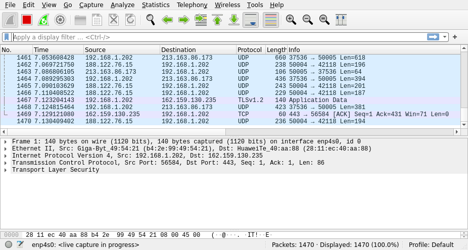
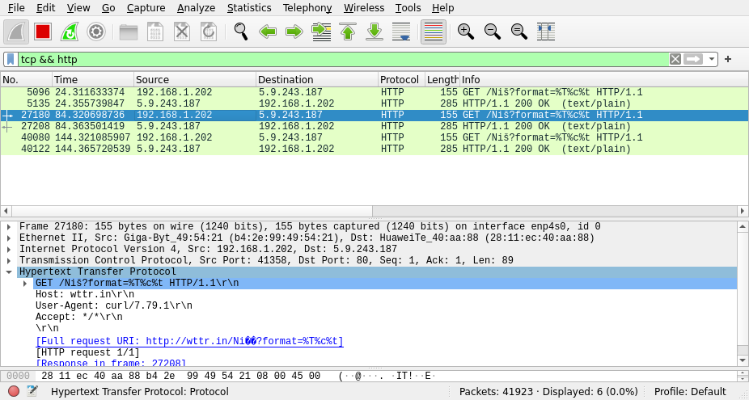

# IT381 DZ01

```
$ john --show crack-these-please 
crack01:bike:526:531::/home/crack01:/bin/bash 
crack02:bloody:527:532::/home/crack02:/bin/bash 
crack03:blue:528:533::/home/crack03:/bin/bash 
crack04:bonjour:529:534::/home/crack04:/bin/bash 
crack05:bread:530:535::/home/crack05:/bin/bash 
crack06:bueno:531:536::/home/crack06:/bin/bash 
crack07:cowboy:532:537::/home/crack07:/bin/bash 
crack08:ddd:533:538::/home/crack08:/bin/bash 
crack09:dejavu:534:539::/home/crack09:/bin/bash 
crack10:dog:535:540::/home/crack10:/bin/bash 
crack11:perro:536:541::/home/crack11:/bin/bash 
crack12:fido:537:542::/home/crack12:/bin/bash 
crack14:hello:539:544::/home/crack14:/bin/bash 
crack15:into:540:545::/home/crack15:/bin/bash 
crack16:japan:541:546::/home/crack16:/bin/bash 
crack17:kaput:542:547::/home/crack17:/bin/bash 
crack18:1337:543:548::/home/crack18:/bin/bash 
crack19:linux:544:549::/home/crack19:/bin/bash 
crack20:mind:545:550::/home/crack20:/bin/bash 
crack21:money:546:551::/home/crack21:/bin/bash 
crack22:more:547:552::/home/crack22:/bin/bash 
crack23:abcdefgh:548:553::/home/crack23:/bin/bash 
crack24:pass:549:554::/home/crack24:/bin/bash 
crack25:really:550:555::/home/crack25:/bin/bash 
crack26:smc:551:556::/home/crack26:/bin/bash 
crack27:stir:552:557::/home/crack27:/bin/bash 
crack28:tall:553:558::/home/crack28:/bin/bash 
crack29:test:554:559::/home/crack29:/bin/bash 
crack30:usa:555:560::/home/crack30:/bin/bash 
crack31:sayonara:556:561::/home/crack31:/bin/bash 
crack36:hackme:561:566::/home/crack36:/bin/bash 
crack3:nauj:564:569::/home/crack39:/bin/bash 
crack41:w:566:571::/home/crack41:/bin/bash 
crack42:ww:567:572::/home/crack42:/bin/bash 
crack43:www:568:573::/home/crack43:/bin/bash 
crack44:www:569:574::/home/crack44:/bin/bash 
crack45:wwww:570:575::/home/crack45:/bin/bash 
crack46:wwwww:571:576::/home/crack46:/bin/bash 
crack47:wwwwww:572:577::/home/crack47:/bin/bash 

39 password hashes cracked, 11 left 

```

1.

a) Ne znam. Par puta mi je krešovao računar u toku razbijanja.
b) 39
c) Sve razbijene su bile mahom proste
d) Većina
e) U razbijenim samo par
f) Kraće

2.

d) 11

3. 

Cain i Abel program nije dostupan na Linux-u koji koristim. Ekvivalent za to je Wireshark koliko sam mogoao
da proučim. On se koristi za analizu mreže i podataka koji kroz mrežu prolaze.





