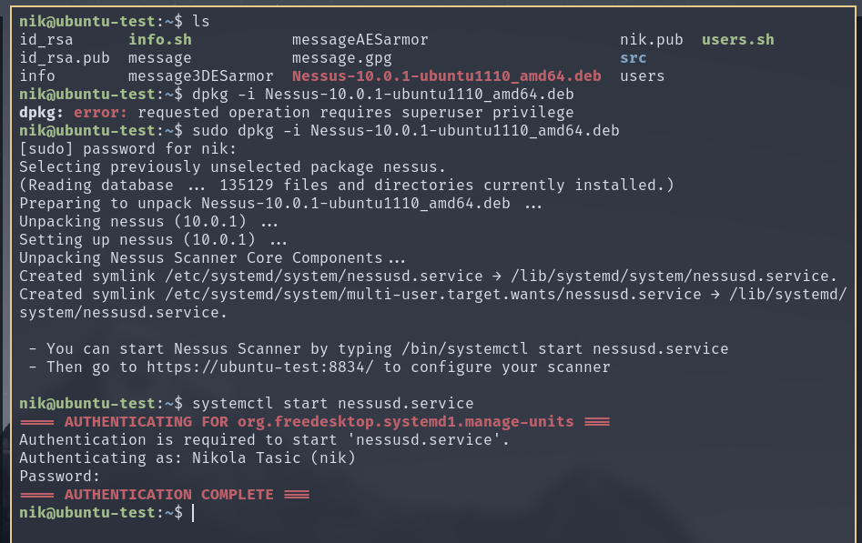

# IT381 DZ07

Instalirao sam Nessus paket ali nisam uspeo da aktiviram.

* Na kojoj je računarskoj arhitekturi baziran Nessus?
	Klijent-server arhitektura
* Koja je prednost ovakve arhitekture?
	Mozemo pristupiti interfejsu sa udaljenje masine.
* Koliko se Nessus razlikuj od alata nmap?
	Nmap je alat za skeniranje a Nessus alat za detekciju propusta
* Šta je to Nessus „plugin“?
	Novododata provera za propust
* U kojem se formatu mogu napisati rezultati Nessus analize.
	Tabla
* Izlistajte i detaljno objasnite koje ste ranjivosti detektovali.
	Nisam uspeo da detektujem
* Zašto se biraju non-DoS skeneri ranjivosti?
	Jer ne prouzrukuju DoS
