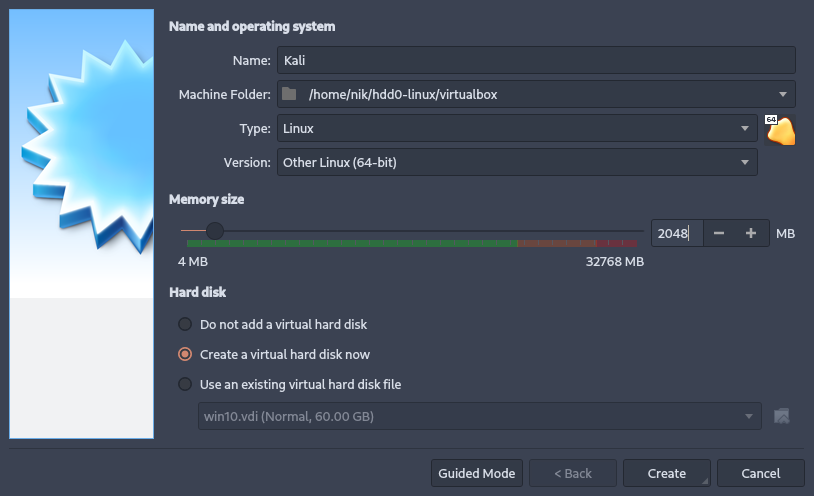
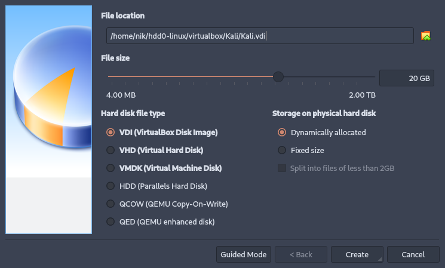
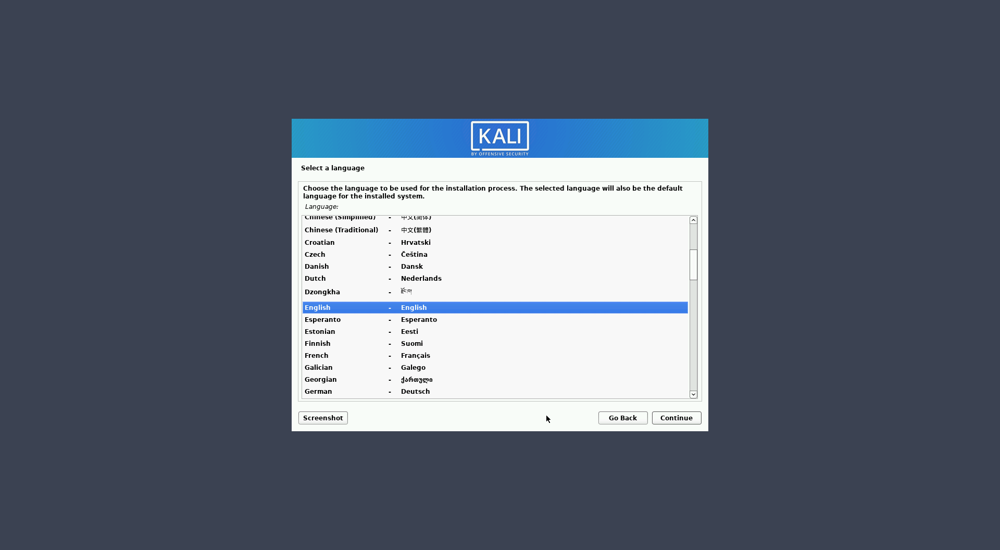
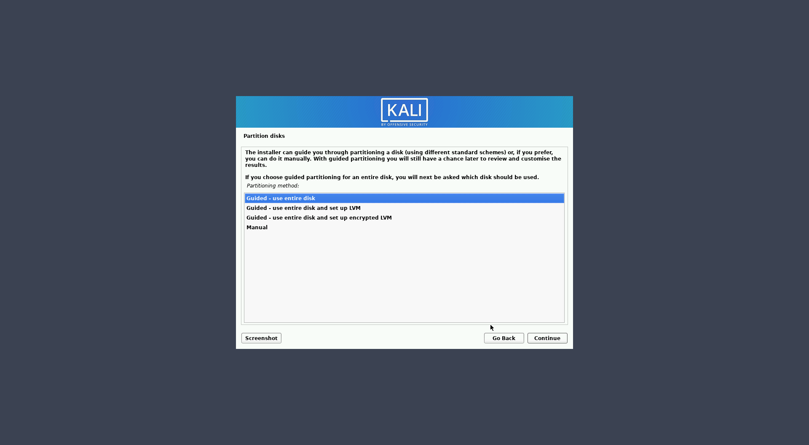
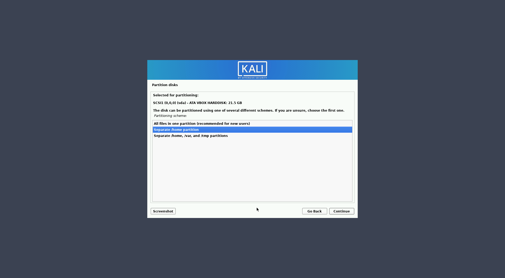
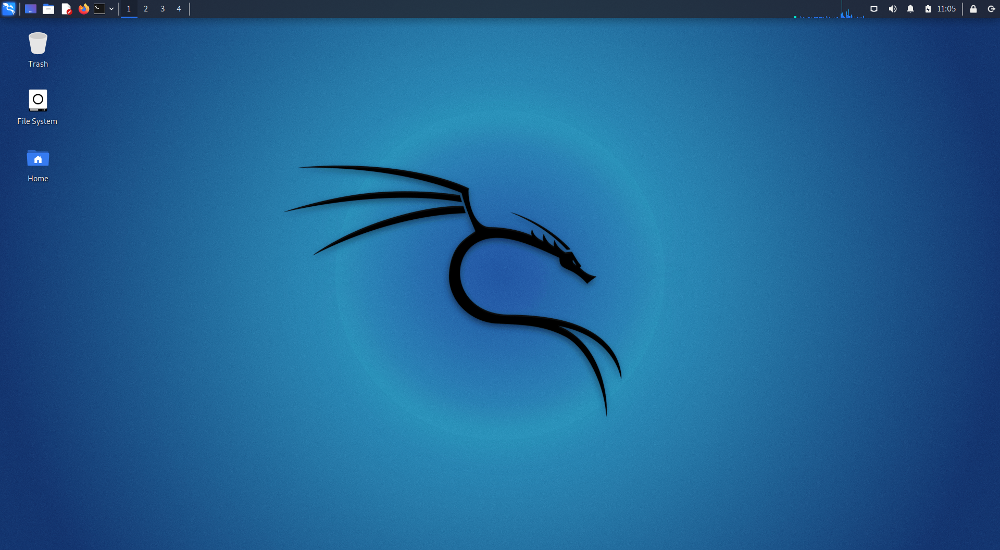

# IT381 DZ10

## Zadatak 01

## Zadatak 02

Kucni ruter ne podrzava WEP protokol

### WEP

Svrha samog WEP protokola je da onemogući „prisluškivanje“ sesije između klijenta i pristupne stanice na samoj bežičnoj mreži, ali ovde se javlja prvi od mnogih problema WEP protokola jer on ne sprečava prisluškivanje između korisnika koji imaju pristup bežičnoj mreži. Pored deljenog ključa koji služi da onemogući neautorizovani pristup bežičnoj mreži, WEP omogućava i sigurnosnu enkripciju podataka i kontrolu integriteta podataka. Sigurnosna enkripcija podataka se vrši pomoću RC4 (Rivest Cipher 4) algoritma koji služi za šifrovanje podataka. WEP protokol koristi ovaj algoritam za enkripciju tako što pravi 64-bitni ključ koji se sastoji od 40 bitova za sam ključ i 24 bita za vektor inicijalizacije IV(Initialization vector). 40- bitni ključ predstavlja gore pomenuti deljeni ključ, a IV je vrednost generisana RC4 algoritmom koja služi primaocu podataka da uspešno dekriptuje podatak. Podatak se enkriptuje tako što se na WEP ključ i na podatak koji se šalje primeni operacija ekskluzivne disjunkcije (XOR). Zatim se IV konkatuje (dodaje) šifrovanom tekstu i šalje ka primaocu. Upravo vrednost IV je najveći problem WEP protokola jer u teoriji, IV mora biti vrednost koja je jedinstvena i koja se koristi samo jednom, a kako bi bilo veoma zahtevno ispuniti ovaj cilj, u praksi se koriste jedinstvene vrednosti IV-a povremeno ponavljaju.

### WPA2

WPA2 sigurnosni protokol je nastao kao poboljšanje WPA protokola, s tim da je dizajniran tako da dodatno ojača enkripciju. Umesto TKIP algoritma koji je korišćen u WPA protokolu, uveden je novi, CCMP (Counter Mode with Cipher Block Chaining Message Authentication Code Protocol) protokol sa algoritmima koji su znatno bolji od TKIP-a. Ključ enkripcije se sastoji od 256 bitova koji enkriptuje podatke koji se šalju bežičnom mrežom. Autentikacija i integritet podataka WPA2 protokola su identični WPA protokolu i koriste iste principe. Najveća mana ova dva algoritma je korišćenje SSID-a kao načina enkripcije jer, kada je poznat SSID, moguće je razbiti ključ enkripcije i tako ugroziti sigurnost podataka. Slabosti predstavljenih protokola i napad na iste biće objašnjen u sledećem poglavlju i biće prikazani praktični primeri napada na WEP i WPA bežičnu mrežu. Objašnjenje napada na predstavljene protokole kao i praktični primeri napada na iste Sigurnosni protokoli, kao što im i samo ime kaže, su napravljeni da bi obezbedili sigurnost podataka u bežičnim mrežama. Iako imaju ovu nameru, ovi protokoli obično imaju “rupe” u svom načinu funkcionisanja koje se mogu iskoristiti za neautorizovani

