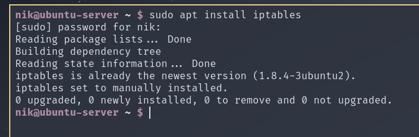
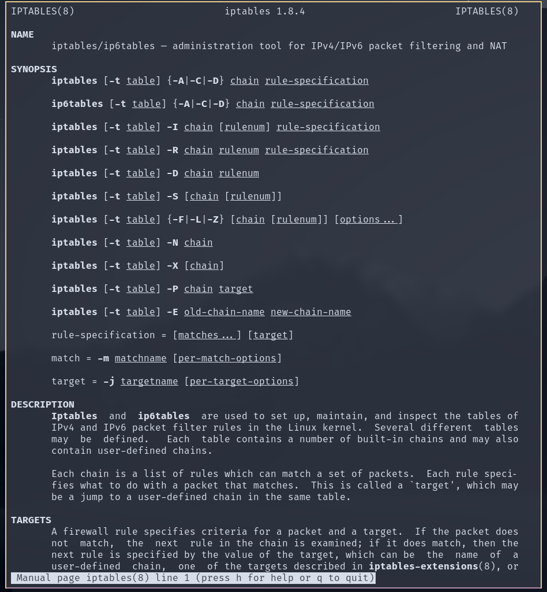

# IT381 DZ11

## Zadatak 01

## Zadatak 02

## Zadatak 03

* Koja komanda briše sva pravila zaštitnog zida?

  Komanda koja briše sva pravila zaštitnog zida je iptables –F.

* Koja je razlika između FORWARD i OUTPUT lanaca? 

  Razlika između FORWARD i OUTPUT lanaca je u  tome što OUTPUT sadrži samo lokalno generisane pakete dok se kod FORWARD-a pakeri preusmeravaju kroz firewall

* Objasniti razliku u korišćenju “-I” i “-A” zastavica (engl. flags) kod konfiguracije iptables?

  Razlika u korišćenu “-I” I “-A” zastavica je tome što prilikom korišćenja “-I” flag-a se prihvataju samo praketi koji dolaze sa specifičnog interfejsa dok flag “-A” koristimo kako kako bismo pravilo dodali na blok pravila.

* Objasniti sledeća iptables pravila:

  * `iptables -A INPUT -s ! 161.53.71.0/255.255.255.0 -i eth0 -p udp -m udp --dport 135:139 -j DROP`

    Input vrši upisivanje novog pravila na definisanu adresu koristeći definisani –dport i odbacuje sve pakete sa tih portova udp portova

  * `iptables -A INPUT -s 161.53.2.70 -p udp -m udp --dport 123 -j ACCEPT`

    Input vrši upisivanje novog pravila na definisanu adresu koristeći definisani –dport prihvata sve pakete sa tih udp portova

  * `iptables -A INPUT -s ! 161.53.71.235 -i eth0 -p tcp -m tcp --dport 873 -j DROP`

    Input vrši upisivanje novog pravila na definisanu adresu koristeci definisani –dport I odbacije sve pakete sa tih tcp portova

  * `iptables -A INPUT -i ppp0 -m state -- state NEW,INVALID -j DROP`

    Odbacuje sve pakete koji nisu validni tačnije ne mogu biti identifikovani. 

  * `iptables -A FORWARD -i ppp0 -m state -- state NEW,INVALID -j DROP`

    Vrši preusmeravanje svih paketa čije je stanje nevalidno. 

## Zadatak 04

* Pravilo treba da odbaci bilo koje dolazeće pakete sa IP adrese 192.168.10.35. Host će odgovoriti sa porukom da paket nije prihvaćen zbog REJECT akcije

  `iptables –A INPUT  -d 192.168.10.35 –j REJECT`

* Pravilo odbacuje sve dolazeće pakete sa IP adrese 192.168.10.35 koji koriste port 23 (telnet).

  `iptables –A INPUT  92.168.10.35 p telnet -m telnet --dport 23 -j REJECT`

* Pravilo dozvoljava zaštitnom zidu da prihvati TCP pakete za rutiranje kada dolaze na interfejs eth0 sa bilo koje IP adrese i šalju se na IP adresu 192.168.1.58 preko interfejsa eth1

  `iptables   –A INPUT 192.168.0.1/32  -i eth0 – d eth1 –s ! 192.168.1.58  -i eth1 -j ACCEPT` 

* Ovo pravilo dozvoljava zaštitnom zidu da pošalje ICMP echo-requests (pings) i da prihvati CMP koje očekuje

  `iptables –A INPUT –s 192.168.1.0/24  -p  icmp –icmp –type echo-request –j ACCEPT1`
