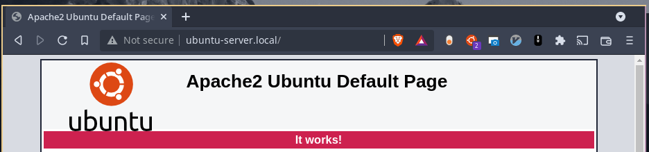
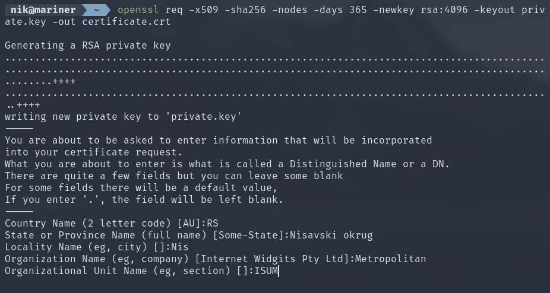
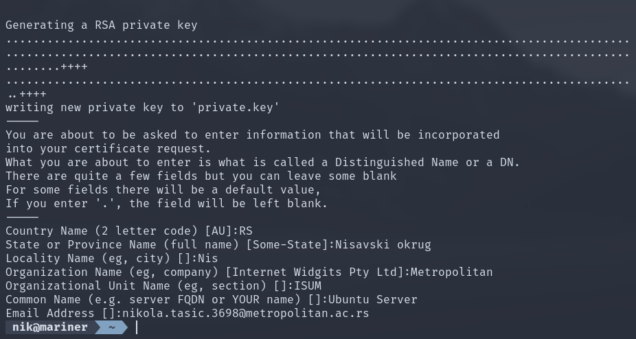
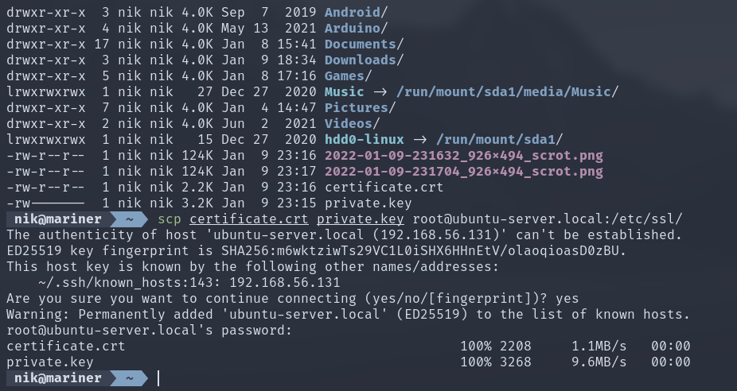
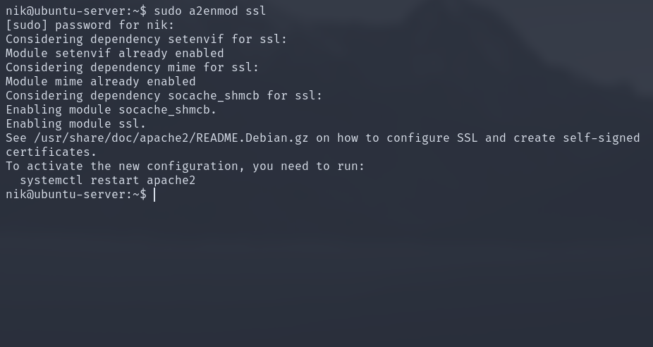
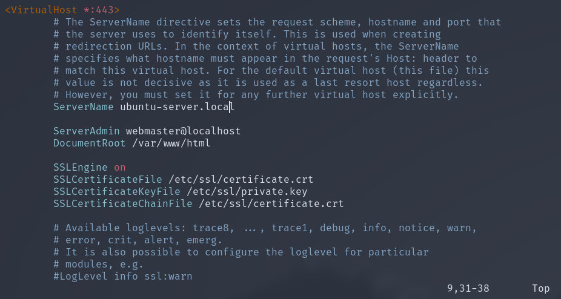
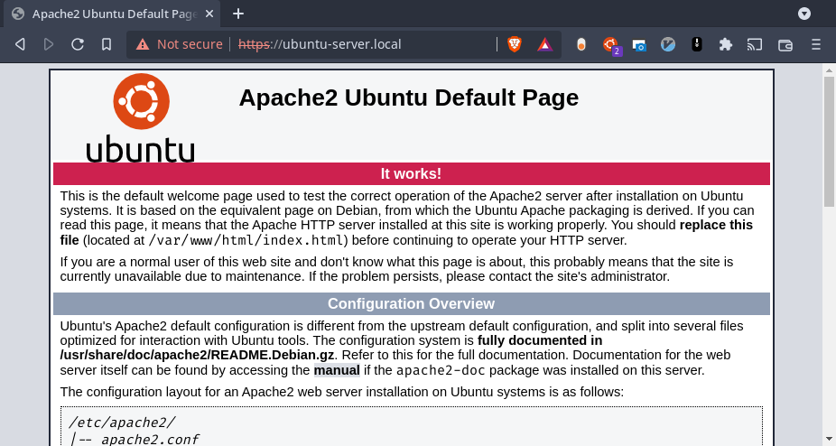

# IT381 DZ13

Početna strana apache2 servera bez SSL-a.

Generišemo SSL sertifikate.

Unosimo sve potrebne podatke.

Kopiramo SSL sertifikate na server.

Omogućavamo apache2 SSL podršku.

Izmena default konfiguracije tako da koristi SSL.

SSL aktivan bez obzira na to da browser prijavljuje grešku(problem je do nevalidnog TLD-a - .local).
