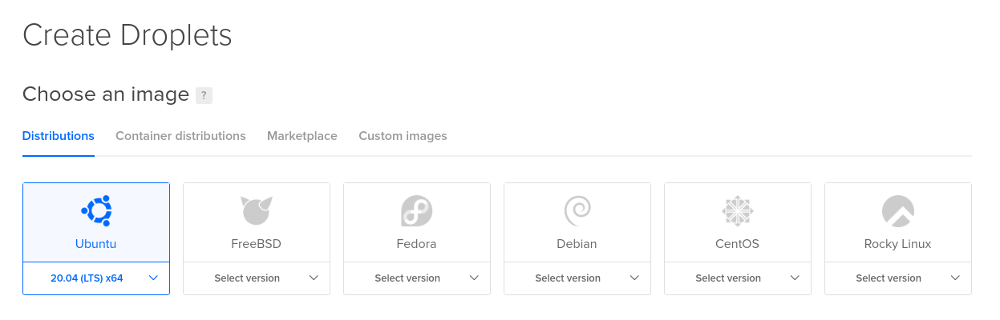
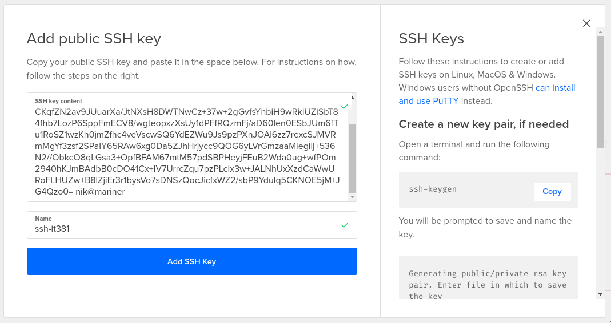

# IT381 Projektni zadatak

Jesenji semetar, 2021/22

Predmet: **IT381: Zaštita i bezbednost informacija**

Profesor: **Milena Bogdanović**

Asistent: **Bojana Tomašević Dražić**

Ime i prezime: **Nikola Tasić**

Broj indeksa: **3698**

Datum izrade: **21.01.2022.**

## Konfiguracija Linux veb servera za potrebe hostovanja vebsajta

## 0. Apstrakt

Prisustvo na internetu je u današnje vreme jako popularna tema, gotovo nephodna za vođenje bilo kakvog biznisa. Postoji bezbroj načina da se ostvari pomeuto prisustvo: društvene mreže, različite vrste veb hostinga/provajdera i sl. Takav pristup iako veoma dostupan svima ima određene olakšice ali i ograničenja. Servisi su kontrolisani od strane drugih kompanija koja mogu imati razna ograničenja koja se tiču sadržaja koji se na njima može objaviti ili tip veb aplikacija koje na njima možemo imati (ako je uopšte moguće). Takođe problem može da bude i personalizacija veb adrese koja može dosta da utiče na posećenost odnosno retenciju kod ljudi. Alternativa svemu ovome je hostovanje ličnog sajta ili veb aplikacije na koristeći vlastiti domen na nekom od popularnih VPS providera.

U ovom tekstu ćemo se fokusirati na inicijalni bezbedni setup Linux servera za jedno na DigitalOcean VPS-u (Virtual Private Server) povezan sa ličnim veb domenom (kupljen na NameCheap-u) na kome se hostuje prezentacioni veb sajt.

Kriterijumi za odabir ovih provajdera se sveo na cenu usluge i lakuću konfiguracije. Konfiguracija domena i kreiranje servera je relativno jednostavna i može je odraditi bilo ko ko ima makar malo iskustva u veb sistemima.

## 1. VPS

Imati sopstveni server može da zvuči kao skup hobi - posedovanje sopstvene "dedicated" mašine u nekom od data-centara jeste i to je u prošlosti bio jedini način za osobu da poseduje svoj veb server. U poslednjih desetak godina sa pojeftinjenjem relevatnih računarskih komponenti i razvojem tehnologija kao što su virtuelizacija i kontejnerizacija stvoren je novi koncept veb server-a koji se naziva VPS - Virtual Private Server.

VPS doduše postoji dug niz godina - virtuelna mašina (ili više njih) za svakog od korisnika na jednom velikom i skupom serveru. Svaki korisnik koji plaća mesečnu pretplatu ima virtuelnu mašinu za sebe koju može da koristi kao god želi. Ovo zvuči dobro jer svaki korisnik u svom sistemu može biti administrator, tj. ne mora zavisiti od adminstratora za konfiguraciju sistema. Virtuelizacija ima naravno svoje nedostatke a to je da emuliranje hardvera da bi se vitruelna mašina koristila utiče na performanse samog host sistema i svih sistema na njemu. To dovodi do potrebe za sve moćnijim i moćnijim hardverom što utiče na cenu u negativnom smislu.

Jedan od najvećih revolucija u vebu u skorije vreme jeste kontejnerizacija koju je u veb doneo Docker. Kontejneri su bili prisutni doduše od vajkada u Unix-based operativnim sistemima ali Docker (koji je baziran na ovim konceptima) je napravio revoluciju u vebu. Pored mnogo različitih benefita koje kontejnerizacija donosi dva za nas (kao buduće sistem administratore - webmastere) najvažniji su sigurnost i performanse. Naime kontejnerizacija za razliku od virtuelizacije emulira samo fajl sistem a ne kompletan hardver koji virtuelna mašina koristi. Ovo dovodi do toga da na istom serveru možemo "hostovati" mnogo puta više korisnika i direktno utiče na manje cene. Kao što smo naveli kontejnerizacija takođe pruža dodatni nivo bezbednosti jer programi koji su pokrenuti u "kontejneru" imaju sve administratorske privilegije, koje su potencijalno neophodne za konfiguraciju nekih veb aplikacija, dok pritom ne mogu da uiču na ostale korisnike koji se nalaze na istom serveru.

## 2. Kreiranje VPS-a

Posle logovanja na DigitalOcean potrebno je kreirati takozvani "Droplet" koji predstavlja vps koji će hostovati našu aplikaciju ili sajt.


<small>Sl. 1 - Kreiranje dropleta</small>

Biramo Ubuntu bilo koje LTS(long term support) verzije jer je on jedan od najbezbednijih generičkih opcija za serverski operativni sistem. Biramo opciju za shared CPU koja je jedan od razloga zašto su cene toliko niske.


<small>Sl. 2 - Kreiranje dropleta - odabir sistema</small>

Naredna opcija je biranje hardvera - tu možemo izabrati šta god u zavisnosti od naših potreba. Za hostovanje običnog veb sajta dovoljno je izabrati najjeftiniju opciju.


<small>Sl. 3 - Kreiranje dropleta - odabir hardvera</small>

Što se tiče lokacije servera bitno je naravno izabrati server koji je relativno blizu targetirane publike. To za prezentacione sajtove nije od neke preterane važnosti ali ping(latencija) do servera može uticati na iskustvo tokom konfigurisanja samog servera. Takođe treba imati na umu kakvi su zakoni koji se tiču privatnosti informacija na internetu u različitim državama u kojima možemo hostovati server.

Naredne opcije od nas zahtevaju da konfigurišemo autentikaciju sa serverom. Ovde imamo dve opcije SSH Key i Password. Password je najjednostavnija opcija ali relativno nebezbedna. S obizrom na to da se fokusiramo na bezbednost odabraćemo SSH Key opciju. SSH Key opcija je klasična autentikacija privatnim i javnim RSA ključem. Da omogućili ovaj vid autentikacije moramo priložiti javni RSA ključ koji će se koristiti za autentikaciju. Za generisanje ključa nam je potreban ssh klijent koji se na Windows operativnim sistemima može naći u Sekciji Options and Features dok na Linux operativnom sistemu se može instalirati preko podrazumevanog package managera.


<small>Sl. 4 - Kreiranje dropleta - autentikacija</small>

SSH RSA ključ se može lako kreirati. Naravno, za to je potreban OpenSSH klijent. Na Windows operativnom sistemu on je dostupan u Apps -> Apps & Features -> Optional features. Za Unix bazirane operativne sisteme on je dostupan za instaliranje preko podrazumevanog package manager-a ako već nije instaliran. Kreiranje javnog i privatnog ključa se vrši komandom `ssh-keygen`. `ssh-keygen` posle pokretanja će nas pitati gde želimo da sačuvamo ključ. Pritiskom na dugme enter podvrđujemo podrazumevanu lokaciju `$HOME/.ssh/id_rsa`. Možemo a i ne moramo izabrati šifru za RSA ključ. Posle izvršetka komande imamo dva fajla u navedenom SSH folderu: `id_rsa` i `id_rsa.pub`. `id_rsa` je naš privatni ključ i on nikako ne sme biti deljen drugim korisnicima jer se može koristiti od strane malicionzih korisnika za impersonizaiciju. `id_rsa.pub` je javni ključ koji DigitalOcean očekuje.


<small>Sl. 5 - Droplet autentikacija - SSH ključ 1</small>

Sledeći korak je kopiranje RSA javnog ključa na DigitalOcean. `id_rsa.pub` fajl možemo otvoriti bilo kog tekstualnog editora ili izlistati sadržaj direktno u terminalu i odatle kopirati u veb formu.


<small>Sl. 6 - Droplet autentikacija - SSH ključ 2</small>

Za kraj možemo opciono odabrati ime dropleta. Klikom na dugme "Create" završavamo konfiguraciju i DigitalOcean će kreirati instancu servera sa konfigurisanim parametrima za nas. Taj proces može da potraje par minuta i kada bude bio gotov umesto progress bar-a dobićemo IP adresu servera na koju se možemo povezati preko konfigurisanog SSH-a.


<small>Sl. 7 - Finalizacija</small>

## 3. Konfiguracija servera

Sada kada je droplet kreiran i kada smo dobili javnu IP adresu možemo mu direktno pristupiti. Koristeći OpenSSH klijent iz terminala možemo pistupiti serveru. OpenSSH predstavlja direktnu enkriptovanu vezu sa serverom. Autentikacija prilikom ove konekcije može da se ostvari na više načina. Podrazumevani način je jednostavna username i password autentikacija koja se smatra relativno nesigurnom. Obzirom da se fokusiramo na sigurnost iz tog razloga je odabrana autentikacija prvatnim i javnim RSA ključem. Pri ovakvoj vrsti razmene informacija obe strane razmenjuju svoje javne ključeve i njih koriste da enkriptuju podatke koje će razmenjivati. Podatak enkriptovan javnim ključem klijenta A može biti dekpriptovan samo privatnim ključem istog klijenta. Na taj način se ostvaruje sigurna komunikacija. Takođe prilikom login-a dolazi do provere identiteta javnim javnim ključem.


<small>Sl. 9 - Login 1</small>

Na server se povezujemo kao **root** koji je podrazumevani super-user korisnik za Unix operativne sisteme. Posle uspešnog logina dočekaće nas podrazumevani ispis osnovnih sistemskih informacija kao što su zauzeće procesora, memorije i diska.


<small>Sl. 10 - Login 2</small>

Sledeći koraci koje ćemo preduzeti su inicijalna konfiguracija sistema i insalacija potrebnih paketa i programa za postavljanje prezentacionog sajta. Prva stvar koju ćemo uraditi je ažuriranje sistema. Ažuriranjem paketa na sistemu dobavljamo njihove najnovije verzije sa najnovijim funkcionalnostima ali pre svega najnovije sigurnosne ispravke koje povećavaju bezbednost sistema.

Pre svega moramo da ažuriramo repozitorijume paketa komandom:

```bash
apt update
```

posle toga natavljamo komandom:

```bash
apt upgrade
```

koja će ažurirati sve pakete. Ubuntu sistem dobija celokupna sistemska ažuriranja na svakih 6 meseci dok se sigurnosna ažuriranja puštaju korisnicima po potrebi van pomenutih predodređenih intervala.

Naredni koraci su instalacija potrebnih paketa koji će doneti programe preko kojih ćemo servira naš vebsajt i osigurati pristup serveru. Sledećom komandom instaliramo te pakete:

```bash
apt install nginx certbot python3-certbot-nginx fail2ban
```
* nginx - veb server

* certbot - alat za generisanje TLS sertifikata

* fail2ban - program za osiguravanje pristupa serveru

Prilikom instalacije sva tri programa će Ubuntu podesiti da se startuju kao pozadinski servisi tako da ne moramo brinuti o njima posle inicijalne konfiguracije. To možemo potvrditi tako što ćemo identifikovati sledeće linije u ispisu `apt install`  komande:

```bash
...
Created symlink /etc/systemd/system/multi-user.target.wants/nginx.service → /lib/systemd/system/nginx.service
...
Created symlink /etc/systemd/system/timers.target.wants/certbot.timer → /lib/systemd/system/certbot.timer
...
Created symlink /etc/systemd/system/multi-user.target.wants/fail2ban.service → /lib/systemd/system/fail2ban.service
...
```

Naravno, uvek možemo potvrditi status svakog od programa komandom `systemctl status`:

```bash
root@ubuntu-s-1vcpu-1gb-amd-sfo3-01:~# systemctl status nginx
● nginx.service - A high performance web server and a reverse proxy server
     Loaded: loaded (/lib/systemd/system/nginx.service; enabled; vendor preset: enabled)
     Active: active (running) since Fri 2022-01-21 21:55:58 UTC; 5min ago
       Docs: man:nginx(8)
   Main PID: 9708 (nginx)
      Tasks: 2 (limit: 1132)
     Memory: 4.4M
     CGroup: /system.slice/nginx.service
             ├─9708 nginx: master process /usr/sbin/nginx -g daemon on; master_process on;
             └─9709 nginx: worker process
```
## 4. Nginx

Nginx je veb server koji ćemo koristiti za serviranje našeg veb sadržaja. On je veoma popularan Linux veb server pored ostalih poznatih imena kao što je **Apache**.

Nginx konfiguracioni fajl se nalazi u `/etc/nginx/nginx.conf` i na sistemu izgleda nekako ovako:

```nginx
# ...

http {

		# ...

        include /etc/nginx/conf.d/*.conf;
        include /etc/nginx/sites-enabled/*;

		# ...
}
# ...
```

Ovde možemo videti da osnovne konfiguracije servera možemo proširiti smeštanjem konfiguracionih fajlova u `/etc/nginx/sites-available`. Nginx će odatle učitati konfiguraciju i moćićemo da serviramo naše sajt. Počećemo s osnovnom konfiguracijom:

```bash
vim /etc/nginx/sites-enabled/website
```
```nginx
server {
	listen 80;
	root /var/www/html/website;
}
```
Posle kreiranja fajla obrisaćemo podrazumevanu nginx konviguraciju komandom:

```bash
rm /etc/nginx/sites-enabled/default
```

Kada smo kreirali našu konfiguraciju i obrisali podrazumevanu možemo pokrenuti komandu `nginx -t` koja će verifikovati da je konfiguracioni fajl ispravan. Kada se uverimo da jeste pokrećemo komandu `nginx -s reload` da bi učitali konfiguraciju i restartovali sam Nginx.

Zatim možemo kreirati prost html sajt u folderu koji smo specificirali u `root` sekciji da potvrdimo da sve funkcioniše kako treba.

```bash
vim /var/www/html/website/index.html
```

```html
<!DOCTYPE html>
<html>
<head>
	<title>Home</title>
</head>
<body>
	<h1>Hello world!</h1>
</body>
</html>
```

Kada smo kompletirali i taj korak vreme je da testiramo naš server tako što ćemo iz browsera posetiti IP adresu servera na koji upravo konfigurišemo.


<small>Sl. 11 - Hello World!</small>

Pre nego što se krenemo sa konfiguracijom domena odradićemo dodaten sigurnosne konfiguracije servera.

## 5. fail2ban

Fail2Ban je program koji služi za automatizovano filtriranje(banovanje) IP adresa koje nevalidno pokusavaju da se autentifikuju na server. Mi trenutno imamo jedan način autentikacije - SSH. SSH je konstantna meta skenera i brute-force napada i mi želimo da to izbegnemo. Naime fail2ban je servis koji skenira logove sistema odnosno servisa koje podesimo da skenira i detektuje učestale pokušaje nevalidne autentikacije. Ako fail2ban detektuje "napad" odnosno "spam" od strane neke adrese on tu adresu filteruje koristeći Linux firewall - `iptables`. Filtrirana IP adresa ostaje fitlrirana neko vreme(podrazumevana vrednost je 10 minuta) i time se sprečavaju brute-force napadi na server. Jedini servis čiji je monitoring po instalaciji već uključen je SSH. Obzirom na to da ćemo imati Nginx podešen i potencijalno na njemu HTTP autentikacijom obezbeđen neki direktorijum ne bi bilo na odmet konfigurisati fail2ban da nadgleda i Nginx. 

Napravićemo zakomentarisanu kopiju podrazumevanog fajla komandom:

```bash
awk '{ printf "# "; print; }' /etc/fail2ban/jail.conf > /etc/fail2ban/jail.local
```

Ovo radimo da ne bi uticali na podrazumevanu konfiguraciju. U fajlu `jail.local` prilagodićemo konfiguraciju za SSH i dodati filtering za Nginx. Izmenu podrazumevane konfiguracije za SSH ćemo odraditi jer je takođe dobra praksa promeniti podrazumevani SSH port (22) u nešto kriptičnije jer napadači uglavnom targetiraju podrazumevani port. U fajlu ćemo otkomentarisati odgovarajuće sekcije i izmeniti navede konfiguracije

```
vim /etc/fail2ban/jail.local
```

```
...
[nginx-http-auth]

enabled = true
...
[sshd]
enabled = true
port = 22381
...
```

Posle izmene fajla moramo restartovati fail2ban servis komandom:

```bash
systemctl restart fail2ban
```

## 6. SSH i firewall

Kao što smo pomenuli promenićemo podrazumevani port za SSH server. Konfiguracija za za ovaj servis se nalazi u fajlu `/etc/ssh/sshd_config`:

```
...
#Port 22
Port 22381
...
```

Takođe pored SSH konfiguracije dodaćemo firewall filtriranje za sve portove osim za one koje svrsishodno otvaramo javnosti. Za konfiguraciju firewall-a na Linux-u se tradicionalno koristi program `iptables`. `iptables` ima veoma moćan ali komplikovan interfejs. Srećom Ubuntu dolazi sa instaliranim paketom pod nazivom `ufw` (**U**ncomplicated **F**ire**W**all) koji je mnogo laši za korišćenje obzirom na to da trebamo dodati samo par prostih pravila. `ufw` u pozadini koristi `iptables` ali je njegov interfejs mnogo lakši za koršćenje. 

Možemo proveriti status servisa komandom:

```
root@ubuntu-s-1vcpu-1gb-amd-sfo3-01:~# ufw status
Status: inactive
```

Sledećim komandama ćemo konfigurisati firewall:

```bash
ufw allow http
ufw allow https
ufw allow 22381 # novi port za ssh
ufw allow ssh   # failsafe
```
Nakon konfigurisanja pravila možemo pokrenuti sledeće komande da uključimo firewall:

``` bash
ufw enable

# Command may disrupt existing ssh connections. Proceed with operation (y|n)? y
# Firewall is active and enabled on system startup

ufw status

# Status: active
# 
# To                         Action      From
# --                         ------      ----
# 80/tcp                     ALLOW       Anywhere
# 443/tcp                    ALLOW       Anywhere
# 22/tcp                     ALLOW       Anywhere
# 22381/tcp                  ALLOW       Anywhere
# 80/tcp (v6)                ALLOW       Anywhere (v6)
# 443/tcp (v6)               ALLOW       Anywhere (v6)
# 22/tcp (v6)                ALLOW       Anywhere (v6)
# 22381/tcp (v6)             ALLOW       Anywhere (v6)
```
S ovim je osnovna firewall konfiguracija podešena.

## 7. Hostname

Svaki vebsajt bi trebalo da ima svoj domen. Domen omogućava lako dobijanje HTTPS sertifikata koji omogućavaju enkriptovanu komunikaciju između servera i klijenta. Domeni se uglavnom plaćaju godišnjom supskripcijom kod nekog od provajera. Odabir provajdera za ovaj rad, Namecheap, je vođen ličnim iskustom i cenom usluga. Nećemo zalaziti u detalje kupovine domena već samo u njegovu konfiguraciju. Da bi kada posetimo registrovani domen browser znao na koju IP adresu treba poslati zahtev je zadužen DNS server. Svaki provajder domena ima svoj DNS server koji može da se konfiguriše sa samog korisničkog naloga. Primer konfiguracije domena za Namecheap izgleda ovako:


<small>Sl. 12 - Dashboard</small>

Klikom na dugme **Manage** pa na tab **Advanced DNS** dobijamo interfejs za konfiguraciju. Na ovom interfejsu potrebno je reći serveru koja je IP adresa koja odgovara domenu koji smo registrovali(ili drugi DNS server koji zna koja je IP adresa). U našem slučaju potrebno je registrovati '@ A Record'. Ovo znači registrujemo informaciju na kojoj IP adresi se nalazi osnovni domen - u ovom slučaju gde se nalazi adresa `7aske.com`. A Record oznacava da je to domen za ipv4. Takođe možemo primetiti podešavanje TTL. TTL ili 'time to live' možemo podesiti na 1min za vreme testiranja servera. Ako želimo da naš server ima pod-domene koji se nalaze na istom Dropletu možemo kreirati i '* A Record' koji u suštini glasi - svi pod-domeni ovog domena se nalaze na ovoj IP adresi.


<small>Sl. 13 - Konfiguracija domena</small>

Posle ove konfiguracije nakon 30min do 1 sata posećivanjem adrese <http://7aske.com> dobićemo našu početnu stranu.


<small>Sl. 14 - Hello World 2</small>

## 8. Vebsajt

Sada već imamo funkcionalan server i vreme je postaviti naš vebsajt. Vebsajt kao primer ovog rada biće lični portfolio vebsajt. U pitanju je React aplikacija koja može da funkcioniše bez backend-a što je idealno za naš primer.

React aplikacije možemo build-voati komandom `npm run build` i gotove fajlove spremne za produkciju ćemo dobiti u folderu `build`. Sledeći korak je te fajlove "deploy-ovati" na server. U slučaju single-page veb aplikacije dovoljno je samo kopirati build fajlove u direktorijum na server koji veb server(nginx) konfigurisan da servira. U našem slučaju to je `/var/www/html/website`. To možemo postići sledećom komandom:

```
scp -P 22381 -r build/* root@7aske.com:/var/www/html/website/
```
Primetite kako sada možemo da koristimo domen za pristup serveru. Takođe s obzirom na to da `scp` (secure copy) komanda koristi ssh za kopiranje podataka moramo specificirati novokonfigurisani port `22381`.

## 9. HTTPS

Za kraj ćemo podesiti TLS odnosno HTTPS za naš server. U današnjem svetu je standard imati HTTPS na bilo kojoj aplikaciji koja je direktno otvorena javnosti i naša neće biti izuzetak. Na početku smo instalirali program `certbot` organizacije Let's Encrpt koji služi da za olašano generisanje CA validnih sertifikata i lak HTTPS. Takođe certbot ima puno pluginova za različite veb server od kojih smo mi instalirali onaj koji je nama potreban - nignx.

Certbot će na uz pomoć plugina detektovati konfiguraciju nginx-a i obaviti ceo proces gotovo automatski. Pre nego što pokrenemo certbot-a moramo malo izmeniti konfiguraciju nginx-a.

```bash
vim /etc/nginx/sites-enabled/website
```
```nginx
server {
	server_name www.7aske.com 7aske.com
	listen 80;
	root /var/www/html/website;
}
```

Ova izmena govori da je domen koji je vezan za ovu serversku konfiguraciju jeste 7aske.com. Nakon restartovanja nginx-a komandom `nginx -s reload` možemo pokrenuti certbot.

Komandom `certbot --nginx` pokrećemo certbot-a i govorimo mu da koristi nginx za detektovanje domena i validaciju domena. Certbot će nas pitati za mail na kome ćemo dobiti obaveštenja o potencijalnom isteku domena ako automatsko obnavljanje ne uspe.

Certbot će takođe predložiti domene koji su dostupni za generisanje sertifikata koja ćemo oba izabrati. Nakon potvrde certbot će generisati sertifikate i automatski izmeniti nginx konfiguraciju tako da se sav http saobraćaj redirektuje na https kodom koji smo izabrali (301 - permanetno, 302 - privremeno). 


<small>Sl. 15 - HTTPS</small>

Nakon ove konfiguracije možemo se uveriti da je zaista došlo do promene u konfiguracionom fajlu za nginx:


```bash
vim /etc/nginx/sites-enabled/website
```
```
```nginx
server {
     server_name www.7aske.com 7aske.com;
     root /var/www/html/website;

     listen 443 ssl; # managed by Certbot
     ssl_certificate /etc/letsencrypt/live/7aske.com/fullchain.pem; # managed by Certbot
     ssl_certificate_key /etc/letsencrypt/live/7aske.com/privkey.pem; # managed by Certbot
     include /etc/letsencrypt/options-ssl-nginx.conf; # managed by Certbot
     ssl_dhparam /etc/letsencrypt/ssl-dhparams.pem; # managed by Certbot
}

server {
     if ($host = www.7aske.com) {
         return 301 https://$host$request_uri;
     } # managed by Certbot


     if ($host = 7aske.com) {
         return 301 https://$host$request_uri;
     } # managed by Certbot


     server_name www.7aske.com 7aske.com;
     listen 80;
     return 404; # managed by Certbot

}

```

I za kraj možemo posetiti <https://7aske.com> da se uverimo da sve funkcioniše.


<small>Sl. 16 - HTTPS podešen</small>

