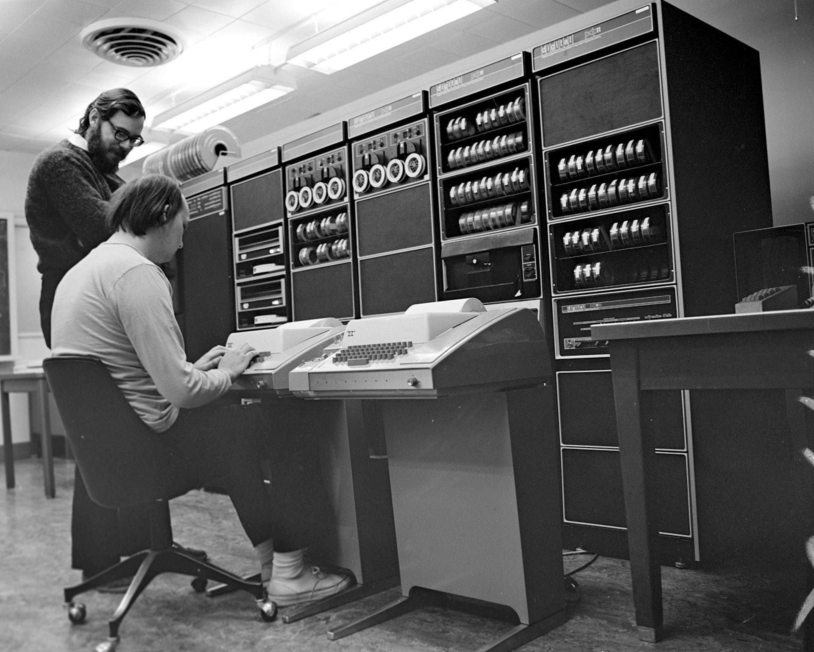
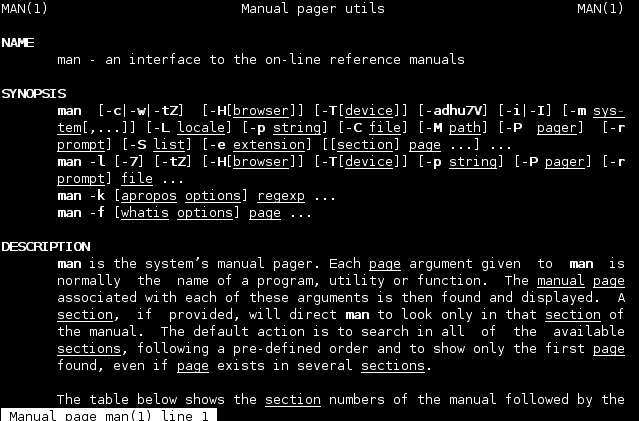
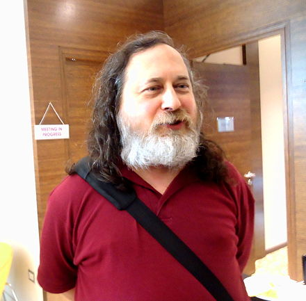

# Topics

+ UNIX

+ Linux

+ GNU Project

# Unix

+ Multics (Second System Syndrome) (MIT, GE, Honeywell)

+ Bell Labs (1969, 1970) 

+ Simpler times

+ C Language (1973)

+ The UNIX Epoch

# Ken and Dennis

# Unix philosophy

+ Write programs that do one thing and do it well.

+ Write programs to work together.

+ Write programs to handle text streams, because that is a universal interface.

# Interface

# Commands 

+ Terminals!

+ But very very slow!

+ Pipes

`man, ls, cd, cat, cc, dd, dc, wc, rm, cp, ed, sed, grep`

`cp thesis.txt ~/Documents/`

`makewords thesis.txt | lowercase | sort | uniq | missmatch`

# Licencing

+ Free until "Version 4" due to monopoly

+ "Version 5" educational institutions, "Version 6" for companies

+ System III, System V

+ Berkley Software Distribution, Microsoft Xenix, Sun Microsystems SunOS

# UNIX Wars

+ Commercial "System V", breakup of Bell System (1983)

+ Richard Stallman founds GNU Project 

+ X/Open (1984)

+ System V Interface Definition SIVD (1985)

+ POSIX (Portable OS Interface) (1988)

+ POSIX triumphs (1995)

# GNU Project

+ GNU is Not Unix

+ Free not as inexpensive but as freedom

+ GNU Manifesto

+ Use, Share, Study, Modify

# Richard Stallman

# GNU Project

# UNIX Descendants

+ BSD

+ Linux (OSX)

+ Darwin

+ Android

+ OpenSolaris

# Linux 

# Inception

+ Developed by Linus Torvalds

+ Kernel based on Minix (1991)

+ Wanted his own UNIX

+ First release - 176.250 SLOC (1992)

+ GNU/Linux

+ Linux today is basically everywhere

# Linus Torvalds

# Thank You 

Thank you for your attention!

... and use free software!
