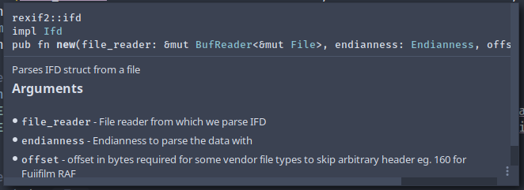

\
\
\
\
\
\
\
\
\

<div align="center">
 
 \

## Prolećni semetar, 2019/20

## SE211: KONSTRUISANJE SOFTVERA

## Projektni zadatak

### rexif2

</div>

\
\
\
\
\
\
\
\
\
\
\
\
\
\
\
\
\
\

### Ime i prezime: **Nikola Tasic**

### Broj indeksa: **3698**

### Datum izrade: **04.06.2020.**

\
\
\
\
\
\

## Opis biblioteke

Biblioteka `rexif2` predstavlja implementaciju parsera **metadata** podataka (tagova) skladistenih u slikama sirovog formata. Sirov format slika koji ova biblioteka obradjuje spada u *TIFF revision 6.0* odnosno *RFC 2306*. Ova biblioteka je napisana za programski jezik **Rust** po ugledu na postojece biblioteke `exiv2`/`libexif` koje su predvidjene za programske jezike C i C++.


## TIFF Format

TIFF format ili `Tagged Image File Format` predstavlja format za cuvanje fotografija bez kompresije kao i cuvanja dodatkih podataka o samoj fotografiji. Bas iz ovog razloga mnogi sirovi (RAW) formati koje koriste digitalni fotoaparati prate bas TIFF specifikaciju.

### Struktura 

TIFF fajlovi su organizovani u tri sekcije: 

* Image File Header (IFH)

* Image File Directory (IFD)

* Bitmap podaci

Od ovih sekcija samo su prve dve neophodne, sto znaci da TIFF fajlovi ne moraju zapravo da imaju podatke o ikakvoj slici. Takvi fajlovi su moguci ali veoma neobicni i retki.

TIFF ume da bude veoma komplikovan format jer lokacije u samom fajlu gde se nalaze IFD sekcije i njihovi odgovarajuci bitmap podaci moze da varira. Jedino sto ima fiksnu lokaciju je zaglavlje (IFH) koji je uvek prvih 8 bajtova bilo kog TIFF fajla (sa par izuzetaka npr Nikon `.NEF` format). Svaki IFD i odgovarajuci bitmap podaci predtavljaju TIFF *podfajl* (*subfile*). Ne postoji ogranicenje koliko *podfajlova* moze da se nadje u jednom fajlu.

Svaki IFD sadzi jedan ili vise struktura koje nazivemo *tagovi*. Svaki tag je je velicine 12 bajtova i sadrzi neki deo informacije o TIFF fajlu (npr. duzinu ekspozicije). Tag moze da sadrzi bilo koji tip podataka i TIFF specifikacija definise preko 70 tagova koji predstavljaju razlicite informacije. Tagovi su redom rasporedjeni u svakom IFD-u. Napomena: Kompanije koje implementiraju TIFF standard cesto dodaju svoje tagove sa dodatnim informacijama tako da i o tome treba voditi racuna.


U daljem tekstu cemo imati primere struktura u programskom jeziku C a kasnije implemetaciju u **Rust**-u.

#### Image File Header

```c
// WORD - 16 bits = 2 bytes
// DWORD - 32 bits = 4 bytes
typedef struct _TiffHeader {
	WORD Identifier;   /* identifikator redosleta bajtova(endianness) */
	WORD Version;      /* TIFF verzija (uvek 2Ah) */
	DWORD IFDOffset;   /* odstupanje u bajtovima od prvog IFD-a */
} TIFHEAD;
```

Identifikator moze da ima vrednost 4949h (II) ili 4D4Dh (MM). Ove vrednosti predtavljaju redosled podataka (bajtova) u TIFF fajlu - Intel format (little-endian) ili Motorola format (big-endian). Ove vrednosti su izabrane jer su identicne bez obzira na raspored. 

Verzija je uvek 2Ah tj. decimalno 42 i ne menja se bez obziran na vrednost TIFF specifikacije. Obzirom na to da se ne menja vise predstavlja identifikator nego zapravo verziju. (*42 - answer to life, universe, etc...*). 

Jedan od dva nacina kako TIFF fajl moze da pocinje:
```
49h 49h 2Ah 00h
```
ili
```
4Dh 4Dh 00h 2Ah
```

IFDOffset predstavlja 32-bitnu vrednost koja odredjuje gde se nalazi prvi Image File Directory. 

#### Image File Directory

Image File Directory ili IFD predstavlja kolekciju informacija slicnjim zaglavlju i koristi se da opise bitmap podatke za koje je *zakacen*. Kao i zaglavlju on sadrzi podatke kao sto su na primer visina i sirina slike, kompresioni algoritam itd. Za razliku od fiksnog zaglavlja IFD je dinamican i moze biti ne samo bilo gde u fajlu nego ih moze biti i vise komada.


```c
typedef struct _TifIfd
{
	WORD NumDirEntries;   /* broj tagova u IFD-u */
	TIFTAG TagList[];     /* lista tagova */
	DWORD NextIFDOffset;  /* odstupanje od sledeceg IFD-a */
} TIFIFD;
```

`NumDirEntries` oznacava broj tagova u IFD-u i samim tim je ogranicena na 65,535. Svaki tag je struktura od 12 bajtova. NextIFDOffset predstavlja odstupanje od sledeceg IFD-a a u slucaju da ih nema vise to polje ima vrednost 00h.

#### Tagovi

Tag kao sto je pomenuto polje sa podacima u zaglavlju. Za razliku od podataka u zaglavljima koji su fiksne velicina tag moze da sadrzi podatke ili pokazivac ka lokaciji gde se nalaze podaci bilo koje velicine. Ova prilagodljivost tagova ima i svoju cenu. Tag koji treba da sadrzi podatke o samo jedom bajtu ipak mora biti velicine 12 bajtova.

```c
typedef struct _TifTag
{
	WORD TagId;         /* identifikator */
	WORD DataType;      /* tip podatka */
	DWORD DataCount;    /* broj(kolicina) podataka */
	DWORD DataOffset;   /* odstupanje do mesta gde se nalaze podaci */
} TIFTAG;
```

`TagId` je numericka vredost informacije koju tag sadrzi. Iz tabele specifikacije mozemo procitati sta taj identifikator prestavlja.

`DataType` sadrzi numericku vrednost koja oznava koji tip podatka tag sadrzi. Neke od vrednost iz TIFF specifikacije su:

```{r table1, echo=FALSE, message=FALSE, warrning=FALSE, results='asis'}
tabl_types <- "
|ID|TYPE     |Description                                    |
|--|---------|-----------------------------------------------|
|1 |BYTE     |8-bit  unsigned integer                        |
|2 |ASCII    |8-bit  NULL-terminated string                  |
|3 |SHORT    |16-bit unsigned integer                        |
|4 |LONG     |32-bit unsigned integer                        |
|5 |RATIONAL |Two 32-bit unsigned integers                   |
|6 |SBYTE    |8-bit signed integer                           |
|7 |UNDEFINE |8-bit byte                                     |
|8 |SSHORT   |16-bit signed integer                          |
|9 |SLONG    |32-bit signed integer                          |
|10|SRATIONAL|Two 32-bit signed integers                     |
|11|FLOAT    |4-byte single-precision IEEE oating-point value|
|12|DOUBLE   |8-byte double-precision IEEE oating-point value|
"
cat(tabl_types)
```

`DataCount` predstavlja broj podataka specificiranih od strane `DataType` polja.

`DataOffset` je 32-bitna (4 bajta) vrednost koja ukazuje na lokaciju podataka u TIFF fajlu koje taj tag opisuje u slucaju da je velicina podataka veca od 4 bajta, u suprotnom podaci se nalaze bas tu. Pakovanje podataka na ovoj lokaciji je jedna od optimizacija. Cesto se podaci ne nalaze ovde.

Neki od tipova podataka i njigove velicine se nalaze u sledecoj tabeli:

```{r table2, echo=FALSE, message=FALSE, warrning=FALSE, results='asis'}
tabl_tags <- "
|Tag Name              |Tag ID|Tag Type       |
|----------------------|------|---------------|
|HalftoneHints         | 321  | SHORT         |
|HostComputer          | 316  | ASCII         |
|ImageDescription      | 270  | ASCII         |
|ImageHeight           | 257  | SHORT or LONG |
|ImageWidth            | 256  | SHORT or LONG |
|InkNames              | 333  | ASCII         |
|InkSet                | 332  | SHORT         |
|JPEGACTTables         | 521  | LONG          |
|JPEGDCTTables         | 520  | LONG          |
|JPEGInterchangeFormat | 513  | LONG          |
"
cat(tabl_tags)
```

## Korisnički zahtevi

### Funkcionalni zahtevi

* Biblioteka programeru korisniku treba da obezbedi metode koje iz njima prosledjenog falja vracaju strukturu koja reprezentuje `TIFF` fajl.

* Struktura koja reprezentuje `TIFF` fajl treba da sadrzi sve parsirane IFD-ove i Tag-ove iz `TIFF` fajla.

* Struktura koja reprezentuje `TIFF` fajl treba da sadrzi sve ne-parsirane Tag-ove tako da ih programer moze parsirati u zavisnosti od svojih potreba.

* Sve moguce greske treba razresiti idiomatski kroz sam jezik **Rust**.

### Nefunkcionalni zahtevi

* Performanse biblioteke moraju biti bolje ili u najmanju ruku po brzini u rasponu od 10% odustpanja od brzine ekvivalentih biblioteke u jezicima `C/C++`. Jezik **Rust** se smatra visoko performantnim jezikom i to ova biblioteka treba da iskoristi.

* Bezbednost koriscenja treba da se ogleda u tome da korscenje biblioteke ni na koji nacin ne sme da utice na strukturu fajlova ili da ih na bilo koji nacin menja bez namere programera.

## Klasni dijagram


Bez obzira na cinjenicu da **Rust** nije objektno-orijentisani jezik na slici imamo klasni dijagram koji predstavlja TIFF strukturu. U okviru `TagType` enumeracije prikazani su samo neki od nekoliko stotina standardnih i nestandardnih tipova TIFF tagova.

## Tehinike i pravila kodiranja

### Primeri komentara i `rustdoc`-a

Rust kao sam po sebi mocan jezik ima i mocan buildchain u vidu `cargo`-a. Cargo pored svih neophodnih funkcionalnosti za build-ovanje, dependency management i drugog ima mogucnost da generise automatsku `html`/`markdown` dokumentaciju na osnovu komentara u samom izvornom kodu. Pored osnovnih `//` komentara Rust ima i `///` komentari koji se u `cargo`-u interpretiraju kao dokumentacija.




### Lintovanje i `rustc`

Rust kompajler odnosno `rustc` je jedan od najsofisticiranijih kompajlera medju modernim jezicima. Njegov macro sistem je bukvalno jezik za sebe a borrow-checker je sistem koji omogucava type i memory safety do sada ne vidjen. Pored svega toga pruza i odlican linting i upozorenja za optimizaciju koda. Cesto se moze reci da ako se vas Rust kod uopste kompajlira znaci da se raditi bez greske. Alata za staticku analizu gotovo i da nema zbog samog dizajna jezika.
\
\
\
\
\

Neki od primera lintovanja:
```
warning: unreachable pattern
   --> src/tagtype.rs:397:13
    |
397 |             6 => TagType::YCbCr,
    |             ^

warning: field is never used: `offset`
  --> src/tiff.rs:20:5
   |
20 |     offset: u64,
   |     ^^^^^^^^^^^
   |
   = note: `#[warn(dead_code)]` on by default

warning: method is never used: `size`
  --> src/tag.rs:85:5
   |
85 |     pub fn size(&self) -> usize {
   |     ^^^^^^^^^^^^^^^^^^^^^^^^^^^

warning: variant is never constructed: `ExposureTime`
   --> src/tagtype.rs:226:5
    |
226 |     ExposureTime,
    |     ^^^^^^^^^^^^

warning: variant is never constructed: `FNumber`
   --> src/tagtype.rs:228:5
    |
228 |     FNumber,
    |     ^^^^^^^

```

Primer veoma opsirnih poruka kod gresaka:
```
error[E0382]: use of moved value: `ifd`
  --> src/tiff.rs:48:29
   |
41 |         let mut ifd = Ifd::new(&mut file_reader, endianness.clone(), offset);
   |             ------- move occurs because `ifd` has type `ifd::Ifd`, which does not implement the `Copy` trait
...
45 |         tiff.files.push(ifd);
   |                         --- value moved here
...
48 |             tiff.files.push(ifd);
   |                             ^^^ value used here after move
```

Evo i primera poruke borrow-checkera
```
error[E0308]: mismatched types
  --> src/tiff.rs:40:34
   |
40 |         let header = Header::new(header_buffer)?;
   |                                  ^^^^^^^^^^^^^
   |                                  |
   |                                  expected &[u8; 8], found array of 8 elements
   |                                  help: consider borrowing here: `&header_buffer`
   |
   = note: expected type `&[u8; 8]`
              found type `[u8; 8]`
```

### Testiranje

Za testiranje u **Rust** programskom jeziku je dovoljno koristiti vec pomenuti `cargo`.

Definisanje slucajeva testiranja se vrsi preko macro direktiva u samom izvornom kodu.

```rust
#[cfg(test)]
mod tests {
    use crate::header::Header;

	/// test slucajevi
}
```
\
\

#### Jedinicno testiranje


	

Pokretanje testova:

```
nik rexif2 master $ cargo test 

running 9 tests
test header::tests::test_ii ... ok
test header::tests::test_invalid_identifier_buf ... ok
test header::tests::test_mm ... ok
test header::tests::test_invalid_version_buf ... ok
test header::tests::test_offset_be ... ok
test header::tests::test_offset_le ... ok
test header::tests::test_zero_offset_be ... ok
test header::tests::test_zero_offset_le ... ok
test tests::test ... ok

test result: ok. 9 passed; 0 failed; 0 ignored; 0 measured; 0 filtered out
```

## Reference 

1. Paul Bourke - [paulbourke.net](http://paulbourke.net/dataformats/tiff/tiff_summary.pdf)

2. Network Working Group - [ieft.org](https://tools.ietf.org/html/rfc2306)

3. Rust Lang - [rust-lang.org](https://doc.rust-lang.org)

4. Steve Klabnik & Carol Nichols - The Rust Programming Language Book

