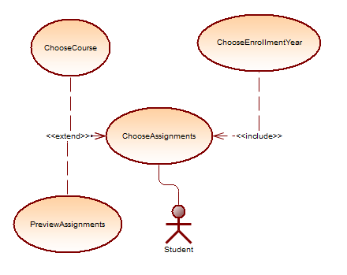
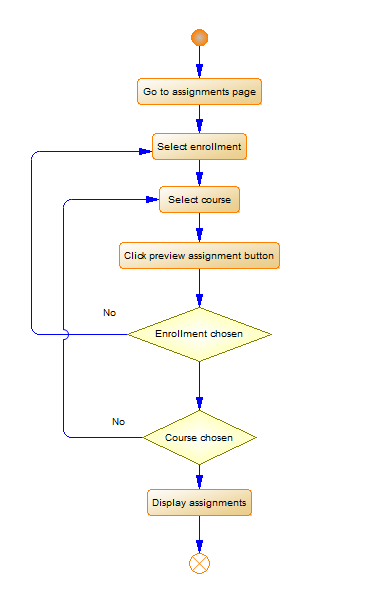

 

 
  

 

 

 
\
\
\
\
\

## Prolećni semetar, 2020/21
 
## *SE321: OBEZBEĐENJE KVALITETA I TESTIRANJE SOFTVERA*

## Domaći zadatak: 01

\
\
\
\
\
\
\
\

Ime i prezime: **Nikola Tasić**

Broj indeksa: **3698**

Datum izrade: **12.10.2020.**

---

### Tekst zadatka:

Odabrati deo ISUM-a namenjen studentima (pregled predispitnih obaveza, prijava ispita, uvid u finansije, pregled položenih ispita, biblioteka).  Treba testirati tok transakcija u ovom delu sistemu od početka do kraja tako što ćete za izabrani deo ISUM-a:

1. Napraviti jedan dijagram slučajeva korišćenja (po izboru) slično kako je to
prikazano u pokaznoj vežbi
2. Za njega definisati dijagram aktivnosti
3. Testirati moguće putanje iz dijagrama aktivnosti
4. Na osnovu rezultata testiranja izvesti zaključak o pouzdanosti sistema, eventualnim nedostacima i mogućim unapređenjima.

### Zadatak:

Obzirom na to je primer prost mogu da dodam samo sledeća opažanja:

Sistem treba da prilikom unosa nevalidnih vrednosti pruži neke povratne informacije korisniku. 

