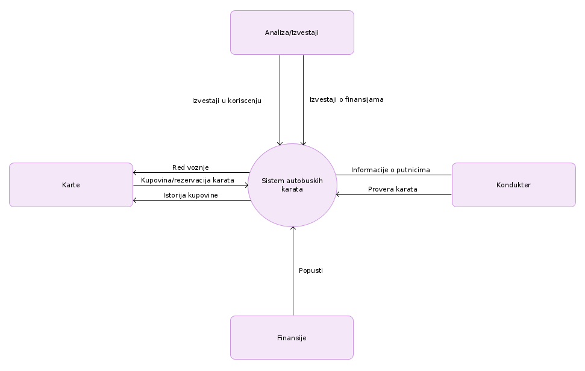

 

 
  

 

 

 
# Prolećni semetar, 2020/21

# *SE322: INŽENJERSTVO ZAHTEVA*

# Domaći zadatak: 03

\
\
\
\
\
\
\
\
\
\
\

Ime i prezime: **Nikola Tasić**

Broj indeksa: **3698**

Datum izrade: **28.11.2020**

---

## Tekst zadataka

Za sistem koji ste dobili za DZ01 uraditi sledeće:

1. Opisati poslovnu pozadinu i priliku

2. Napisati izjavu o viziji

3. Primeniti jednu od tehnika za reprezentaciju obima (na primer Dijagram konteksta)

## Rešenje

## Poslovna prilika

Sistem se razvija za potrebe javnog gradkog prevoza. U jeku svetske pandemije
kritično je u svim sferama života dovesti do povećanja sigurnosti ljudi.
Situacija zahteva da se što je više moguće smanji kontakt među ljudima ali s
obzirom na činjenicu da veliki broj ljudi zavisi od gradskog prevoza da bi
stilgo na posao moramo razviti ovu aplikaciju. Postojanje ovakve aplikacije bi
olakšalo i modenizovalo iskustvo korišćenja gradskog prevoza i da situacija
nije ovakva kakva jeste. Razvoj ove aplikacije mora biti veoma brz i efikasan
da bi se što pre pustila u rad i pomogla pri smanjenju širenja pandemije u
našim gradovima.

## Vizija

Ova aplikacija kada se bude razvija će imati neverovatan uticaj na poboljšanje
sigurnosti ljudi u gradskom prevozu smanjenjem socijalnog kontakta. S obzirom
na činjenicu da veliki broj ljudi koristi gradski prevoz da bi došlo na posao
možemo sprečiti mere ukidanja gradskog prevoza. U slučaju ukidanja gradskog
prevoza mnogi građjani bi bili dovedeni u situaciju da traže alternativne
metode transporta za koje mnogi verovatno nisu spremni. Ovim proizvodom želimo
da to sprečimo i očuvamo funkcionalnost svih ostalih institucija.

\
\
\
\
\
\
\
\
\
\
\
\

## Dijagram konteksta

