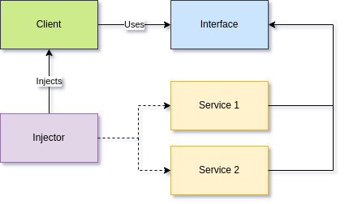

# Uvod

* Pojam radnog okvira

    Alat koji omogućava lakši i brži razvoj aplikacija.

* Radni okviri u Javi

    Spring, Quarkus, Micronaut ...

* Motivacija za kreiranje radnog okvira

    Prilika za učenje - otprilike samo to.

# Zastupljenost radnih okvira


# HTTP

* HTTP protokol

    Protokol za komunikaciju između klijenta i servera.

* HTTP zahtev i odgovor

    ```
    -> GET / HTTP/1.1
       ...
    ```

    ```
    <- HTTP/1.1 200 OK
       ...
    ```

# HTTP

```java
public class HttpServerApplication extends GrainApp {
    public static void main(String[] args) {
        GrainAppRunner.run(HttpServerApplication.class);
    }

    @Controller
    @RequestMapping("/")
    public class HttpServerController {
        @GetMapping
        public String index() {
            return "Hello World!";
        }
    }
}
```

# Obrada HTTP zahteva


# Umetanje zavisnosti

{ width=80% }

# Templejting jezik

* Templejting jezik

    Jezik za generisanje dinamičkih veb stranica.

```jsp
<head> <% @Imports() %> </head>
<nav>
    <a href="/" class="brand-logo">Grain</a>
    <ul>
    <% if (authentication != null) { %>
        <li><a href="/logout">Logout</a></li>
    <% } else { %>
        <li><a href="/login">Login</a></li>
    <% } %>
    </ul>
</nav>
```

# Primer aplikacije


# Implementacija

```jsp
<head>
    <% @Imports() %>
    <title>Grain | ${title}</title>
</head>
<body>
    <% @Nav() %>
    <main id="index-page" class="container">
        <div class="row mb-0">
            <% @Pagination() %> </div>
        <div class="row">
            <% foreach (movie in movies)
                @MovieCard(movie=movie); %> </div>
    </main>
</body>
</html>
```

# Implementacija

```java
@Controller
@RequestMapping("/")
public class IndexController {
    private final MovieService movieService;
    @GetMapping
    public View index(@RequestParam(value = "page",
                                    defaultValue = "0,3")
                                    Pageable page) {
        TemplateView view = new TemplateView("index.gtl");
        view.addAttribute("movies",
            movieService.findAll(page));
        return view;
    }
}
```

# Aplikacija u "produkciji"

Aplikacija je takođe dostupna na [http://cinema.grain.7aske.xyz/](http://cinema.grain.7aske.xyz).

# Zaključak

...

#

Hvala na pažnji!
